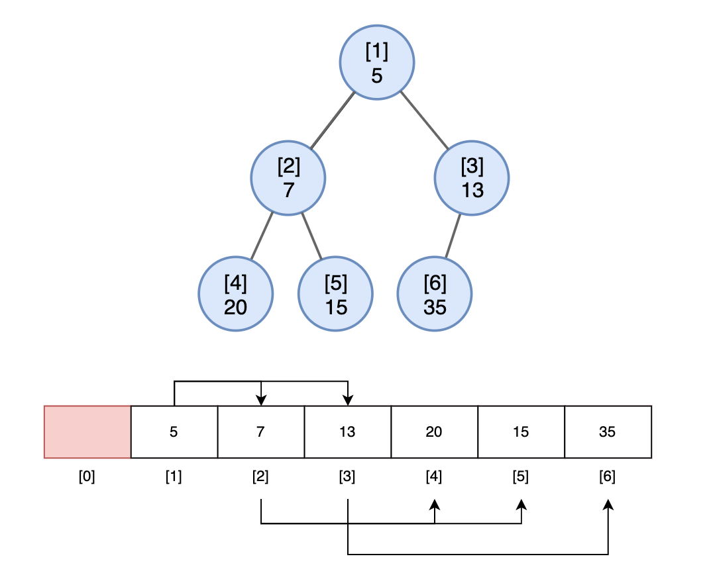
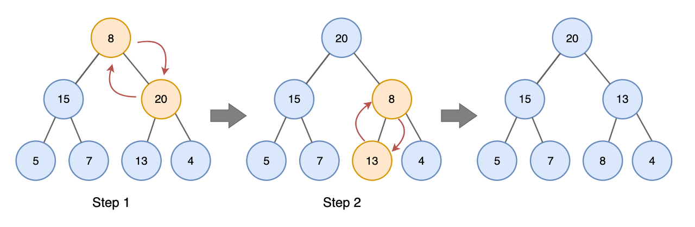
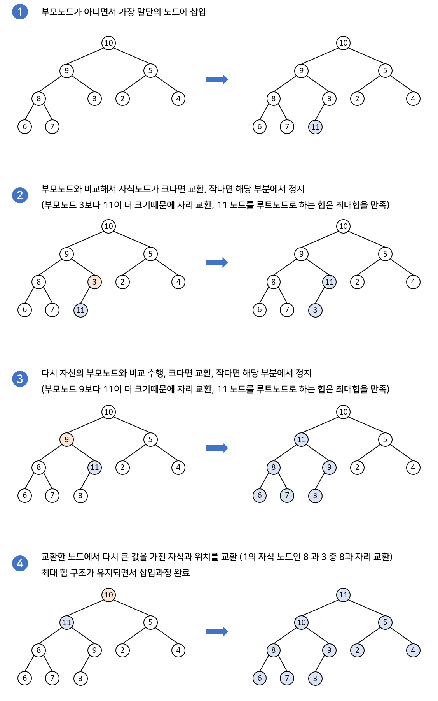
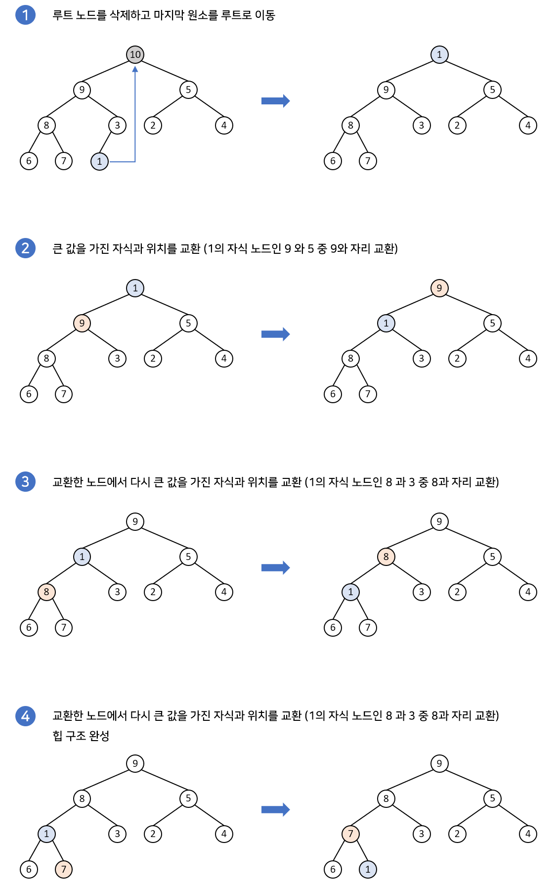

# Heap(힙)

## Heap이란?
힙은 **최댓값** 및 **최솟값**을 찾아내는 연산을 **빠르게** 하기 위해 고안된 **완전이진트리**를 기본으로 한 자료구조로서 다음과 같은 힙 속성을 만족합니다. (완전이진트리는 마지막 리프 노드를 제외한 모든 노드에서 자식들이 완전히 채워진 트리를 말합니다.)
* A가 B의 부모노드(parent node)이면, A의 키(key) 값과 B의 키값 사이에는 대소 관계가 성립한다.
  * 키값 대소관계는 오로지 **부모와 자식 간에만 성립**되며 **형제사이에는 대소 관계가 성립되지 않음**.

**최소/최댓값의 확인 및 삭제가 필요할 때** Heap을 사용하면 수행 속도가 빠르고 좋습니다.

## Heap의 종류

### 1. 최대 힙(Max Heap)

* 부모노드의 키 값이 자식노드의 키값보다 항상 큰 힙

* Key(부모노드) >= Key(자식노드)

* 가장 큰 값이 루트노드에 있음

### 2. 최소 힙(Min Heap)

* 부모노드의 키 값이 자식노드의 키값보다 항상 작은 힙

* Key(부모노드) <= Key(자식노드)

* 가장 작은 값이 루트노드에 있음

## 힙의 구현
힙은 일반적으로 **배열**로 표현합니다. 물론 연결리스트로도 구현이 가능하지만, 문제는 특정 노드의 '검색', '이동'과정이 조금 더 번거롭기 때문입니다.

구현을 쉽게 하기 위해 배열 인덱스 1부터 사용하는데요, 고유 번호(인덱스)를 통해 부모/자식노드를 구할때 아래와 같은 규칙이 있습니다.

### 힙에서의 부모 노드와 자식 노드의 관계
* 왼쪽 자식의 인덱스 = (부모노드의 인덱스) * 2
* 오른쪽 자식의 인덱스 = (부모노드의 인덱스) * 2 + 1
* 부모의 인덱스 = (자식노드의 인덱스) / 2

## 삽입, 삭제로 깨진 힙을 재구조화(heapify)
힙에서 삽입, 삭제가 일어나게 되면 경우에 따라 최대 힙, 최소 엉덩이의 조건이 깨질 수 있습니다. 

이러한 경우 해당 조건을 만족할 수 있게 노드들의 위치를 바꿔가며 힙을 재구조화(heapify)하는 과정이 필요합니다. 

보통 힙에서 삽입과 삭제의 경우 연산 자체는 `O(1)`로 동작하지만, 재구조화(heapify)의 과정을 거치기 때문에 `O(logn)`의 시간복잡도를 가지게 됩니다.

Max heap에서 heapify의 작업은 다음과 같습니다.

1. 요소 값과 자식 노드 값을 비교합니다.
2. 만약 자식 노드 값이 크다면 왼쪽 오른쪽 자식 중 가장 큰 값으로 교환합니다.
3. 힙 속성이 유지될 때까지 1,2번 과정을 반복합니다.

다음 그림은 값이 8인 노드에 대해 최대 힙 heapify를 수행하는 예입니다.

Step 1. 첫 번째 노드 값(8)이 자식보다 작으므로 자식 중 가장 큰 오른쪽 자식 값(20)과 교환합니다.

Step 2. 값이 8인 노드에서 heapify를 다시 시작합니다. 8이 왼쪽 자식 노드 13보다 작기 때문에 교환합니다.

이제 8이 leaf node이므로 heapify를 추가로 호출해도 힙 구조에 영향을 주지 않습니다.

## 힙(heap)의 삽입

힙의 삽입과정은 다음과 같습니다.

1. 힙의 마지막 노드에 새로운 노드를 삽입한다. `시간복잡도 O(1)` 
2. 이후 부모 노드와 비교하면서 재구조화(heapify) 과정을 수행합니다. `시간복잡도 O(log N)`

즉, 삽입과정은 아래에서 위로 재구조화 과정이 이루어지게 되는것 입니다. 힙에서의 삽입 과정의 시간복잡도는 `O(log N)`이 됩니다.

아래의 예시는 최대 힙에 값 11을 갖는 노드를 삽입하고 재구조화하는 과정입니다.

## 힙(heap)의 삭제

힙의 삭제 과정은 다음과 같습니다.

1. 루트노드를 삭제합니다. `시간복잡도 O(1)` 
2. 가장 마지막 말단 노드를 루트노드 자리에 대체합니다.
3. 이후 재구조화 과정을 수행합니다. `시간복잡도 O(log N)`

즉, 삭제 과정은 위에서 아래로 재구조화 과정이 이루어지게 됩니다. 힙에서의 삭제 과정의 시간복잡도는 `O(log N)`이 됩니다.

아래의 예시는 최대 힙에서 루트노드를 삭제한 후 재구조화하는 과정을 나타냅니다. 

## 힙(heap)의 조회

최대 힙에서 최대 값인 루트 노트의 값을 조회할 경우 시간복잡도는 `O(1)`, 
최소 힙에서 최소 값인 루트 노트의 값을 조회할 경우 시간복잡도는 `O(1)`  입니다.

## heap과 Priority Queue(우선순위 큐)
우선순위 큐는 가장 우선순위가 높은 데이터를 먼저 꺼내기 위해 고안된 자료구조입니다. 

우선순위 큐는 보통 heap과 같이 거론되곤 하는데요. 이는 우선순위 큐가 주로 힙 자료구조를 사용해 구현되기 때문입니다. (배열, 연결리스트로 구현할 수 도 있지만 시간복잡도 측면에서 힙이 더 낫기 때문)

## heap과 BST의 차이점
### heap
* Heap에서는 상위 level에 존재하는 값이 하위 level에 존재하는 값보다 우선순위가 높다.
* 하지만 좌/우에서의 우선순위는 절대적이지 않다.
* 왼쪽의 값이 우선순위가 높을 수도, 오른쪽의 값이 우선순위가 높을 수도 있다.
* Heap에서는 root가 가장 우선순위가 높기 때문에 가장 작은 값을 추출하거나 가장 큰 값을 추출해야 하는 경우 사용한다.

### BST(Binary Search Tree)
* BST에서는 왼쪽의 값이 오른쪽의 값보다 작다.
* 하지만 상/하에서의 값은 절대적이지 않다.
* 상위 level에 존재하는 값이 하위 level에 존재하는 값보다 클 수도, 작을 수도 있다.
* BST는 (평균적으로) 탐색이 O(log n), 삽입/삭제가 O(log n)에 가능하기 때문에 탐색이 빈번하게 일어나는 경우 사용한다.

## 예상 질문

* Heap은 기본적으로 어떤 자료구조를 사용하나요?

* Heap의 삭제, 삽입의 원리와 시간복잡도는?

* 우선순위 큐(Priority Queue)의 동작 원리가 어떻게 되나요? 

우선순위 큐는 가장 우선순위가 높은 데이터를 먼저 꺼내기 위해 고안된 자료구조입니다. 

우선순위 큐는 주로 힙이라는 자료구조를 가지고 구현합니다. top이 최대면 최대 힙, top이 최소면 최소 힙으로 표현합니다. 힙으로 구현된 이진트리는 모든 정점이 자기 자식 요소보다 우선순위가 높다는 성질을 가지고 있습니다. 이 성질을 통해 삽입과 삭제 연산을 모두 O(logN)으로 수행할 수 있습니다.

* Heap과 BST의 차이점이 무엇인가요?