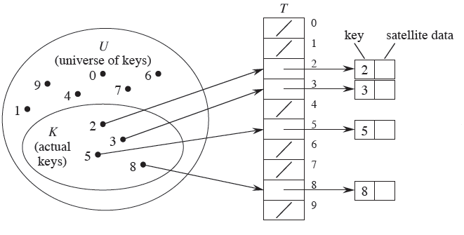
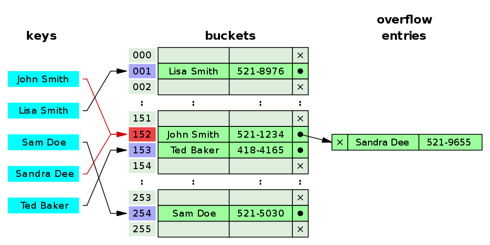
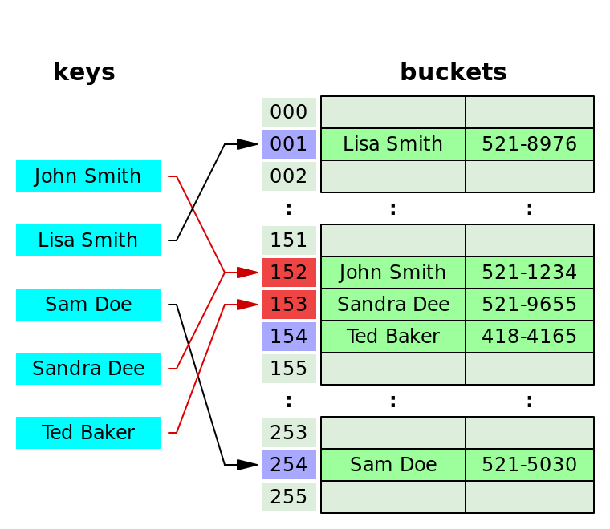

# 해시(Hash)

# 해시란?

- 데이터를 효율적으로 관리하기 위해 임의의 길이 데이터를 고정된 길이 데이터로 매핑하는 것
- 특정 해시 함수를 구현하여 데이터 값을 해시 값으로 매핑

# 해시 함수

- 정의 : 키를 고정된 길이의 해시로 변경해주는 함수
- key → 입력값, hash → 출력값(저장 위치)
    
    
    

# 장점

- Key-Value가 1:1로 매핑되어 있기 때문에, 삽입, 삭제, 검색 연산이 모두 평균적으로 O(1) 시간 복잡도를 갖는다

# 단점

- 해시 충돌이 발생할 수 있다.
- 순서나 관계가 있는 배열에는 어울리지 않는다
- 공간 효율성이 떨어진다 → 데이터 저장 이전에 미리 저장공간이 필요하기 때문에, 공간을 만들었지만 채워지지 않는 경우가 발생할 수 있다
- hash function의 의존도가 높다.

# 해시함수 선택

- `Trade-Off` : 상충 관계. 한 측면에서 이득을 얻으면 다른 부분에서 손해를 볼 수밖에 없음
- 해시 함수는 무조건 복잡하다고 좋은 것이 아닌, 트레이드오프 관계에 있다.

## Value의 범위가 넓은 해시함수

- 장점
    - 해시 충돌이 발생할 가능성이 줄어든다
- 단점
    - value의 크기가 커지기 때문에 데이터 크기 면에서 공간 효율성이 떨어진다
    - value의 범위가 커지기 때문에 사전 공간의 공간 효율성이 떨어진다

# 해시 충돌

- 서로 다른 두 가지 Key를 해시 함수를 통해 얻은 해시 값이 동일한 현상
- 해시 함수의 편향성 문제일 수도 있고, 해시 공간 부족 문제일 수도 있음
- 해시 공간은 결국 유한하기 때문에, 해시 충돌은 필연적

## 해시 충돌 회피 방법

1. Chaining
- 충돌 발생 시 동일한 버킷 내에 연결리스트 형식으로 저장하는 방법
- 삽입의 경우 연결리스트에 추가하면 되므로 O(1), 탐색/삭제의 경우 최악의 경우 O(k) 가 걸림

1. Open Addressing
- 해시함수로 얻은 해시 값에 따라 데이터와 키값을 저장하지만, 동일한 주소에 다른 데이터가 있을 경우 다른 주소도 활용할 수 있게 하는 기법
- 삽입 시 계산한 해시 값에 대한 인덱스가 이미 차 있는 경우 다음 인덱스로 이동한다

- 충돌 처리 기법
    - 선형 탐사
        - 고정 폭만큼 인접한 공간에 데이터를 삽입(K+n)
        - 데이터 밀집 현상이 일어날 수 있음
    - 제곱 탐사
        - 정해진 고정 폭을 제곱수로 변경하여 해시값의 중복을 피함(K + n^2)
    - 이중 해싱
        - 처음 해시함수로는 해시 값을 찾고, 두번째 해시함수로 탐사폭을 계산한다

# 자바에서의 해시

## hashCode

- 특정 해시 함수 알고리즘에 의해 생성된 정수 값
- equals와 엮어서 자주 사용
- 해시코드 규약이 존재
    - equals 비교에 사용되는 정보가 변경되지 않았다면, 애플리케이션이 실행되는 동안 그 객체의 hashCode 메소드는 몇 번을 호출해도 일관되게 항상 같은 값을 반환해야 한다.(단, 애플리케이션을 다시 실행한다면 이 값이 달라져도 상관없다.)
    - equals(Object)가 두 객체를 같다고 판단했다면, 두 객체의 hashCode는 똑같은 값을 반환해야 한다.
    - equals(Object)가 두 객체를 다르다고 판단했더라도, 두 객체의 hashCode가 서로 다른 값을 반환할 필요는 없다. 단, 다른 객체에 대해서는 다른 값을 반환해야 해시테이블의 성능이 좋아진다.

## 해시코드를 사용하는 자료 구조

- Hash 자료 구조
    - HashSet
    - HashMap
    - HashTable
- 해당 자료 구조를 활용할 때는, equals()메소드만 재정의하는 것이 아니라 hashCode() 메소드도 재정의하여 논리적 동등 객체일 경우 동일한 해시코드가 리턴되도록 해야 한다