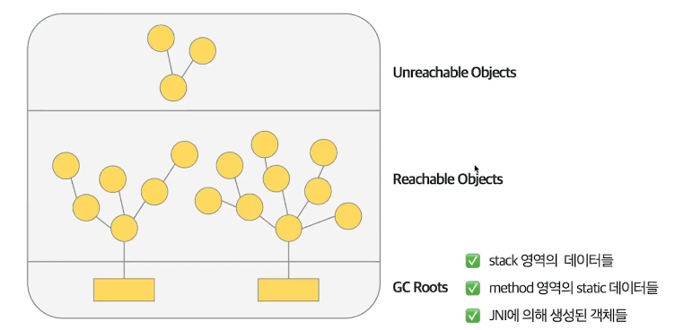
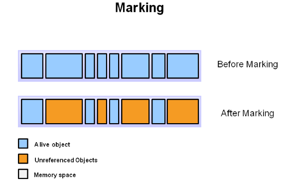
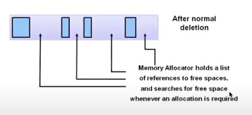
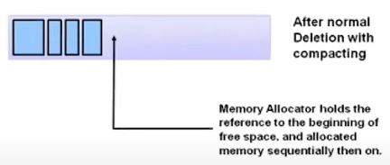
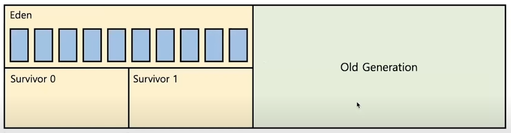
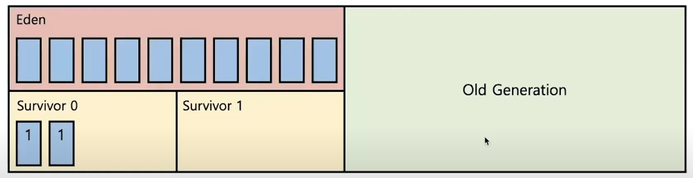
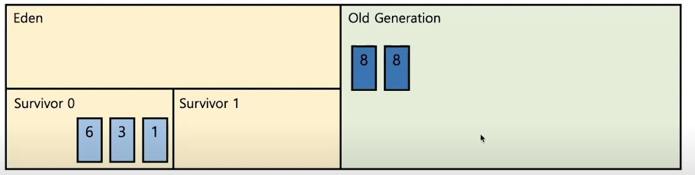
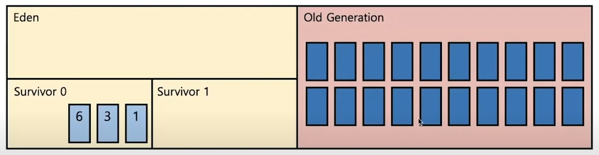

# GC(Garbage Collection)

## GC란?

C, C++에서는 `free()`라는 메소드를 통해 할당된 메모리를 직접 해지 해줘야합니다. 

반면, 자바에서는 메모리 관리를 JVM에서 해주게 되는데 이를 위해 Garbage Collection을 사용합니다. 

GC는 JVM의 Heap 영역에서 사용하지 않는 객체를 삭제하는 프로세스를 말합니다. 

JVM의 힙(heap) 영역에는 Object 타입의 데이터들이 들어갑니다. (String, List, class 등)

## GC의 수거 대상: Reachability

그렇다면 GC는 어떻게 삭제할 객체와 아닌 객체를 ***구분***할까요? 

우선, 이를 알아보기전에 Unreachable Objects와 Reachable Objects에 대한 이해가 필요합니다.

```java
public class Main {
    public static void main(String[] args) {
        Person person = new Person("a", "곧 참조되지 않음");
        person = new Person("b", "참조가 유지됨");
        //GC 발생 가정 시점
    }
}

//Person은 "name"과 "description"을 필드로 가지며, 생성자에서 차례대로 주입받게 됨.
```

위의 코드를 보시면 person 처음에 "a"라는 이름을 가진 객체를 참조하게 됩니다.

하지만 바로 person이 "b"를 참조하게 되면서 "a"에 대한 참조를 잃어버리게 됩니다.

해당 main 함수가 종료되기 직전, GC가 발생한다고 가정해보면 "b"는 참조가 유지된 상태이지만 "a"는 참조 되어있지 않은 상태이기때문에 GC의 대상이 됩니다.

이처럼 ***참조되고 있는지***에 대한 개념을 reachability라고 하고, 참조된 상태를 reachable, 참조되지 않은 상태를 unreachable이라고 합니다. 

즉, Unreachable Objects는 참조되지 않은 객체이며 Reachable Objects는 참조된 객체라고 볼 수 있습니다. 

이제 다시 질문으로 돌아와서, GC는 어떻게 삭제할 객체와 아닌 객체를 ***구분***할까요? 



사진과 같이 GC 루트에서부터 각각 참조하고 있는 객체들을 하나씩 하나씩 탐색해나갑니다.

그러면 참조된 객체들은 Reachable Objects, 참조되고 있지 않은 객체들을 Unreachable Objects하다고 표현합니다. 이러한 Unreachable Objects가 GC의 수거대상이 됩니다.

그렇다면 GC 루트가 될 수 있는 조건은 무엇일까요? 

JVM stack 영역의 지역변수나 파라미터들, 메소드 영역에 있는 static 데이터들, 자바 네이티브 인터페이스에 의해 생성된 객체들이 해당됩니다. 

## GC의 동작 순서

GC의 동작순서는 다음과 같습니다.

* Stop the world
* Mark and Sweep, Compact

### Stop the world

우선 Stop the world에 대해 알아보자면, GC를 실행하기 위해 JVM이 어플리케이션 실행을 멈추는 것입니다. 

Stop the world가 발생하면 GC를 실행하는 쓰레드를 제외한 나머지 쓰레드들은 작업을 멈춥니다(stop). 

그 후 GC 작업이 완료되면 중단했던 작업을 다시 시작합니다. 

stop the world가 실행되면 mark and sweep이라는 알고리즘이 작동하게 됩니다.

### Mark and Sweep, Compact



Mark는 GC 루트로부터 모든 변수를 스캔하면서 각각 어떤 객체를 참조하고 있는지 찾아서 마킹하는 과정입니다. 즉, 위에서 설명한 Reachable Objects와 Unreachable Objects를 식별하는 과정입니다. 



Sweep은 Unreachable Objects를 heap에서 제거하는 과정입니다.

그리고 알고리즘에 따라서 Compact 과정이 추가되기도 합니다.



Compact는 Sweep 후 heap 영역에 듬성듬성 분산되어 남아 있는 객체들을 한곳에 모아 메모리 단편화를 막아주는 작업입니다.

그래서 GC가 한번 수행될때마다 Mark and Sweep, Compact 과정까지 한 사이클이 돌아가게 됩니다.

## heap 구조

heap 영역에서 어떤 방식으로 GC가 발생하는지 heap 구조를 통해 세부적으로 알아봅시다.


heap 영역은 크게 Young Generation과 Old Generation으로 나뉩니다. 

Young Generation은 새로운 객체들이 할당되는 영역이며

Old Generation은 Young Generation에서 오랫동안 살아남은 객체들이 존재하는 영역입니다.

또한, Young Generation은 Eden, Survivor 0, Survivor 1로 나뉘어집니다.

이러한 heap 구조에서 GC가 언제 일어날까요?

## GC가 일어나는 경우

GC는 Minor GC와 Major GC로 구분되는데요, 우선 Minor GC부터 알아보겠습니다.



새로운 객체가 Eden 영역에 할당이 됩니다. 그림과 같이 만약 더 이상 할당될 공간이 없다면 이때 Minor GC가 일어나게 되고 이때 Mark and Sweep이 발생하게 됩니다.


 위 그림과 같이 Minor GC에서 살아남은 객체(파란색 박스)들은 Survivor 영역으로 이동합니다.살아남지 못한 객체(하얀색 박스)들은 Sweep 과정을 통해 Eden 영역에서 삭제됩니다.


 그 후 Survivor 영역에 있는 살아남은 객체들은 age값이 1씩 증가됩니다.

 다시 Eden 영역이 꽉 차고 Minor GC가 발생되다보면 Survivor 영역에 있는 객체의 age 값이 점점 증가하게 되겠죠?


 이렇게 age값이 증가하다가 객체의 age가 age threshold(임계점)에 도달하면 Old Generation으로 이동하게 됩니다.


이와 같은 과정을 반복하게 되어 Old generation이 꽉 차게 되면 Major GC가 발생하게 됩니다.

## Major GC와 Minor GC로 나뉘어진 이유
이렇게 나누어진 이유는 GC가 두가지 가설하에 만들어졌기 때문인데요, 

* 대부분의 객체는 금방 접근 불가능 상태(unreachable)가 된다. (금방 garbage가 된다)
* 오래된 객체에서 젊은 객체로의 참조는 아주 적게 존재한다.

그렇기 때문에 Minor GC는 매우 빈번하게 일어날 것이고, Major GC는 자주 일어나지도 않고, 일어나더라도 많은 객체가 정리되지 않기 때문에 분리했다고 볼 수 있습니다.

---
## 예상되는 질문
* GC가 무엇인가요?
* GC가 일어나는 이유에 대해 설명해주세요
* GC 동작과정에 대해 설명해주세요
* GC가 Major GC와 Minor GC로 나뉘어진 이유가 무엇인가요