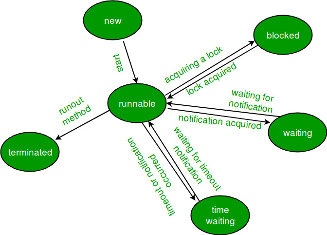
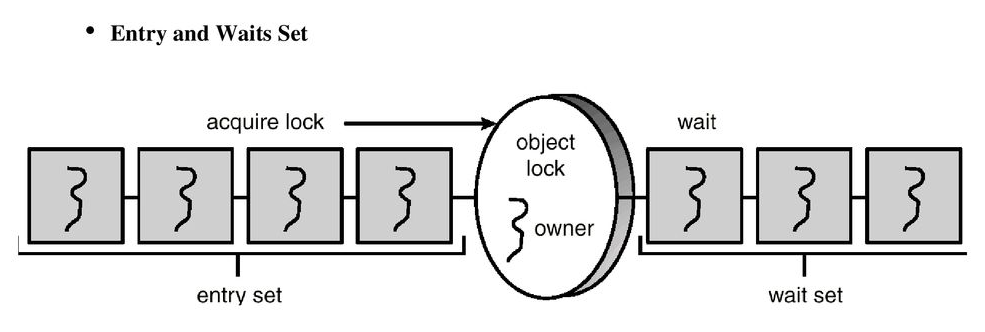

# Java Thread, 동기화

# Java에서 Thread 사용법

## Thread 클래스 상속

```java
/** 
		Thread module 기본 사용법
**/

public class Sample extends Thread {
    @Override
		public void run() {  // Thread 를 상속하면 run 메서드를 구현해야 한다.
        System.out.println("thread run.");
    }

    public static void main(String[] args) {
        Sample sample = new Sample();
        sample.start();  // start()로 쓰레드를 실행한다.
    }
}
```

- 기본적으로 run() 메서드를 Override 하고, start() 메서드를 이용하여 쓰레드를 실행한다.
- 실제 start 메서드의 코드를 보면,  start0라는 native method를 활용하여 context switching을 구현하고, start 메서드 내부에서는 단순히 현재 실행되고 있는 쓰레드들이 정상적으로 수행되고 있는지 판단 후 실행 중 쓰레드의 그룹에 넣어주는 행위만 수행하고 있다

```java
/**
		Thread class 내 start 메소드 구현
**/
		public synchronized void start() {
        /**
         * This method is not invoked for the main method thread or "system"
         * group threads created/set up by the VM. Any new functionality added
         * to this method in the future may have to also be added to the VM.
         *
         * A zero status value corresponds to state "NEW".
         */
        if (threadStatus != 0)
            throw new IllegalThreadStateException();

        /* Notify the group that this thread is about to be started
         * so that it can be added to the group's list of threads
         * and the group's unstarted count can be decremented. */
        group.add(this);

        boolean started = false;
        try {
            start0();
            started = true;
        } finally {
            try {
                if (!started) {
                    group.threadStartFailed(this);
                }
            } catch (Throwable ignore) {
                /* do nothing. If start0 threw a Throwable then
                  it will be passed up the call stack */
            }
        }
    }

    private native void start0();
```

- run 메서드의 코드를 보면, Override를 위해 만들어진 코드 형태로 초기 실행 시 에러만 발생하지 않도록 핸들링해주고 있는 것을 볼 수 있다.

```java
/**
		Thread class 내 run 메소드 구현
**/
		@Override
    public void run() {
        if (target != null) {
            target.run();
        }
    }
```

- 결론적으로, Java에서는 jvm에서 thread의 context switching을 담당하고 있다.

## Runnable 인터페이스 구현

```java
/** 
		Runnable 인터페이스 기본 사용법
**/

public class Sample implements Runnable {
    @Override
		public void run() {  // run 메서드를 구현해야 한다.
        System.out.println("thread run.");
    }

    public static void main(String[] args) {
        Thread t = new Thread(new Sample()); // Runnable한 객체를 생성자로 받는 Thread 클래스를 생성한다
        t.start();  // start()로 쓰레드를 실행한다.
    }
}
```

- 기본적인 사용법은 Thread 클래스와 동일하다. 하지만 인터페이스 형태로, run 메서드를 항상 구현해야 하고, Thread 해당 구현체를 Thread 객체의 생성자로 넣어 줌으로써 쓰레드를 생성할 수 있다.

```java
/**
		Runnable한 객체를 이용한 Thread 생성
**/
		public Thread(Runnable target) {
        init(null, target, "Thread-" + nextThreadNum(), 0);
    }
```

- 여러 오버로딩된 생성자 중, 위의 생성자 형식을 활용했다고 볼 수 있다
- 사용법은 거의 동일하지만, 인터페이스를 활용하기 때문에 상속 등에서 좀 더 유연하게 사용할 수 있다.

## run() 메서드 사용과 start()메서드 사용의 차이?

- run()메서드를 사용할 때
    - 단순히 하나의 프로세스에서 쓰레드를 순차적으로 실행한다.
    - context switching이 발생하지 않는다.
- start()메서드를 사용할 때
    - 위의 코드에서 볼 수 있듯, start0()라는 native 메서드를 활용하여 context switching 수행
    - JVM 내부에서 다수의 콜 스택을 번갈아가며 일처리를 수행하고, 동시에 작업하는 것처럼 보여 주는 것
- 위의 두 구현 방법 모두에 해당한다

# JAVA에서의 쓰레드 생명 주기



출처 : GeeksforGeeks

- 총 6가지의 lifecycle이 존재한다.
- 다양하게 표현되어 있고, Running을 표현하는 경우도 있지만, 실제로 Java 구현체를 확인해 보면 위와 같은 형태로, Thread.State라는 enum 클래스 형태로 구현되어 있다.
    
    ```java
    public enum State {
            NEW,
            RUNNABLE,
            BLOCKED,
            WAITING,
            TIMED_WAITING,
            TERMINATED;
        }
    ```
    
    - NEW : 쓰레드가 처음 생성되고, 아직 시작되지 않은 상태
    - RUNNABLE : 실행 가능한 상태로, JVM 내에서는 실행 중이지만 프로세서와 같은 다른 리소스를 기다리고 있는 상태, 지속적으로 컨텍스트 스위칭이 일어날 수 있는 상태
    - BLOCKED : 모니터의 lock으로 인해 멈춰 있는 상태로, synchronized 상태의 블록이나 메소드에 진입하고자 할 때 다른 스레드들이 얻는 상태 → busy-waiting
    - WAITING : 대기 중인 스레드 상태로, 시간 초과가 존재하지 않는 wait()이나 join()을 활용하여 대기 중인 상태. notify()나 notifyAll()을 이용하여 깨워 줄 수 있음 → block-wakeup
    - TIMED_WAITING : 시간 제한이 존재하는 대기 상태로, sleep()이나 timeout이 존재하는 wait, join을 이용하여 대기 중인 상태
    - TERMINATED : 스레드의 실행이 완료된 상태

# Java에서의 동기화 방법

- 기본적으로 Java에서는 고수준의 Monitor와 같은 병행성 기법을 제공하고 있음

## synchronized 키워드

- 객체 중심의 언어인 Java에서는 모든 객체가 모니터를 갖고 있음 → synchronized 이용
    - synchronized method
        - 해당 메서드가 존재하는 객체 인스턴스와 연결된 락 방법
        - 다른 스레드가 락을 소유한 경우 해당 메소드를 호출한 스레드는 BLOCKED 상태가 되고, 객체의 락에 존재하는 entry set에 추가됨
        - 스레드가 메소드를 종료하면 해당 객체에 대한 락이 해제
        
        ```java
        public class SynchronizedCounter {
            private int c = 0;
        
            public synchronized void increment() {
                c++;
            }
        
            public synchronized void decrement() {
                c--;
            }
        
            public synchronized int value() {
                return c;
            }
        }
        // 출처 : oracle java docs
        ```
        
    - synchronized + wait + notify
        - 스레드가 락 문제가 아닌, 자원 등의 문제로 인해 대기해야 할수도 있음
        ex) 유한 버퍼에서 버퍼가 꽉 찬 경우
        → wait() 호출을 통해 락을 해제하고 조건이 충족될 때까지 기다림(WAITING 상태로 wait set에 추가)
        - 결론적으로 아래와 같은 그림 형태의 set으로 대기
        
        
        
        출처 : Operating System Concepts(공룡책)
        
        - 일반적인 synchronized 메소드 종료 시, 이탈 스레드는 객체에 대한 락을 해제함으로써 entry set의 스레드에게 소유권을 넘겨줌
        - 그러나 특정 스레드가 synchronized 메소드 내부에서 notify() 호출을 수행하면 다른 일이 발생
            1. wait set에서 스레드 선택
            2. 해당 스레드를 entry set으로 이동 후 RUNNABLE 상태로 변경
    - synchronized block
        - 락의 획득과 해제 시점 → lock scope
        - 메소드 단위로 사용하면 lock scope가 너무 커질 수 있음
        - 메소드 내의 특정 코드 블록만 동기화 가능
        - 동일하게 해당 객체에 대한 객체 락 소유권 필요
        
        ```java
        // 자신 객체에 대한 synchronized block
        public void addName(String name) {
            synchronized(this) {
                lastName = name;
                nameCount++;
            }
            nameList.add(name);
        }
        
        // 별도 객체에 대한 synchronized block 설정도 가능
        public class MsLunch {
            private long c1 = 0;
            private long c2 = 0;
            private Object lock1 = new Object();
            private Object lock2 = new Object();
        
            public void inc1() {
                synchronized(lock1) {
                    c1++;
                }
            }
        
            public void inc2() {
                synchronized(lock2) {
                    c2++;
                }
            }
        }
        
        // 출처 : oracle java docs
        ```
        

## volatile 키워드

- 읽기, 쓰기의 경우 기본적으로 atomic함(long, double형 제외)
(읽기+쓰기는 atomic한 행위 2회이므로 atomic하지 않음)
- volatile 키워드를 사용하면 long, double 형도 atomic하게 읽고 쓸 수 있음
    - long, double primitive 형은 64비트 형태이기 때문에, 32비트씩 나누어서 읽어들이기 때문
    - java의 volatile 키워드는 즉각적으로 메인 메모리에 쓰거나 읽어오는 것을 보장하고, 가시성을 보장하는 키워드
    - 한 쓰레드에서만 쓰기 작업, 다른 쓰레드는 읽기 작업만 할 때 안전성 보장
    - 두 쓰레드가 동시에 쓰기 작업에 들어간다면 동시성 문제가 발생할 수 있음

## High Level Concurrency Objects

### Reentrant Lock

- 단일 스레드가 소유하며 공유 자원에 대한 상호 배타적 액세스 제공
- 공정성 매개변수 등의 추가 기능 제공 → 오래 기다린 스레드에 락 제공하는 기능

### Semaphore

- 카운팅 세마포어 제공
- acquire와 release를 통해 인터럽트를 방어함
- 락을 획득하려는 스레드가 인터럽트 되는 경우 acquire() 메소드가 InterruptedException을 발생

### Condition Variable

- wait(), notify()메소드와 유사한 기능을 제공
- ReentrantLock과 연계하여 사용
- await()과 signal() 메소드를 활용
- wait(), notify()와 다른 점은 스레드 번호를 통해 어떤 스레드가 signal 신호를 받을지 지정할 수 있다는 점

### Atomic Variable

- 원자성을 보장해 주는 변수
- synchronized 키워드 없이 동기화 문제 해결
- CAS 알고리즘 활용
* CAS(Compare-And-Swap) : 비교한 뒤 바꿔주는 것, 스레드에 저장된 값과 메인 메모리에 저장된 값을 비교하여 값이 같다면 새로운 값으로 치환해 준다.
- 내부에 존재하는 여러 메소드들을 활용하여 원자성을 보장하는 연산을 수행할 수 있음
- 동시에 쓰기 작업에 들어가는 경우에도 원자성을 보장

### Concurrent Collections

- 스레드 동시성을 보장해 주는 컬렉션 객체
- BlockingQueue, ConcurrentMap, ConcurrentNavigationMap 등의 다양한 동기화를 제공하는 Collections 객체들이 존재

참고문헌

[https://docs.oracle.com/javase/tutorial/essential/concurrency/index.html](https://docs.oracle.com/javase/tutorial/essential/concurrency/index.html)

[https://stackoverflow.com/questions/34387242/why-using-volatile-makes-long-and-double-atomic](https://stackoverflow.com/questions/34387242/why-using-volatile-makes-long-and-double-atomic)

[https://docs.oracle.com/javase/8/docs/api/java/util/concurrent](https://docs.oracle.com/javase/8/docs/api/java/util/concurrent)