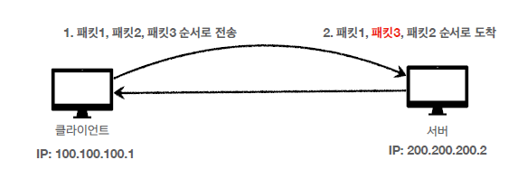
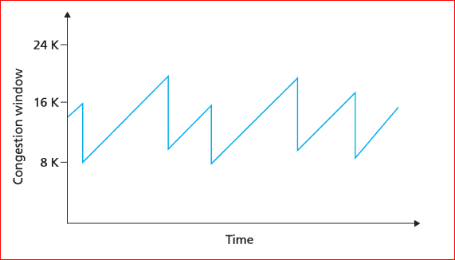
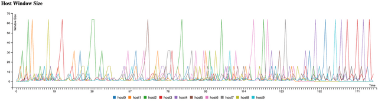
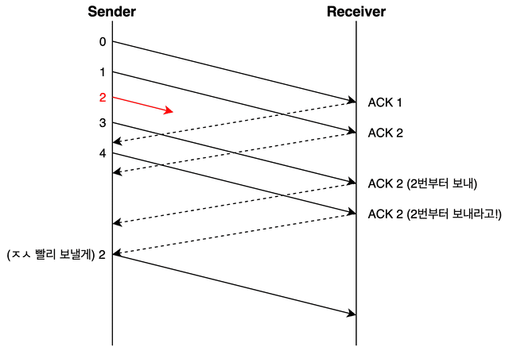
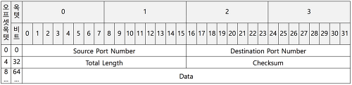
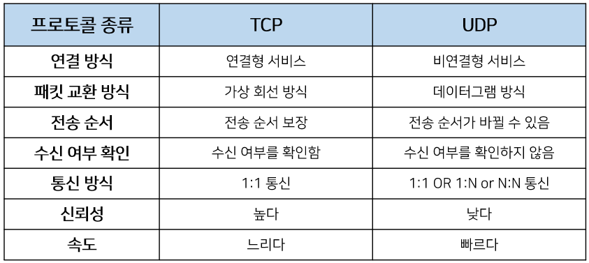

# TCP/UDP

## TCP란? (Transmission Control Protocol)
TCP는 신뢰성있는 데이터 통신을 가능하게 해주는 프로토콜입니다.

TCP는 다음과 같은 특징을 갖는데요,
* 특징: Connection 연결 (3-Way Handshake), 양방향 통신
* 데이터의 순차 전송을 보장
* Flow Control (흐름 제어)
* Congestion Control(혼잡 제어)
* Error Detection (오류 감지)

이러한 특징들에 대해 자세히 살펴보기전에 TCP의 헤더에 대해서 알아보겠습니다.

### TCP Header

위 사진은 TCP 헤더의 구조입니다. (TCP 세그먼트 구조라고도 부릅니다) 보시면 발신지 포트 번호인 Source port, 목적지 포트 번호인 Destination Port를 갖게 되며 데이터 순차 전송을 위해 Sequence Number, Acknowledgement Number을 갖습니다. 

주목해야할 부분은 빨간색 네모 박스인데요, ACK, SYN, FIN 플래그를 갖습니다. 
해당 플래그들은 3 Way-handshake, 4 Way-handshake에서 사용되어집니다.

그렇다면 3-Way Handshake와 4-Way Handshake에서 어떤 방식으로 사용될까요?

### 3-Way Handshake
3-Way Handshake란 클라이언트와 서버간의 가상회선을 수립하는 과정입니다. 즉, 클라이언트는 서버에 요청을 전송할 수 있는지, 서버는 클라이언트에게 응답을 전송할 수 있는지 확인하는 과정입니다.

여기서 사용되는 플래그는 SYN, ACK 플래그입니다.

* SYN : 접속 요청(패킷 송신)
* ACK : 요청 수락(패킷을 받았다고 응답)

TCP의 3-way Handshaking 과정은 다음과 같습니다.

1. 클라이언트는 서버에 접속을 요청하는 SYN 패킷을 보냅니다. 이때 클라이언트는 SYN/ACK 응답을 기다리는 SYN_SENT 상태가 됩니다.

2. 서버는 SYN요청을 받고 클라이언트에게 요청을 수락한다는 ACK 와 SYN flag 가 설정된 패킷을 발송하고 클라이언트가 다시 ACK으로 응답하기를 기다립니다. 이때 서버는 SYN_RECEIVED 상태가 됩니다.

3. 클라이언트는 서버에게 ACK을 보내고 이후로부터는 연결이 이루어지고 데이터가 오갈 수 있습니다. 이때의 서버 상태가 ESTABLISHED 입니다.

위와 같은 방식으로 3-Way Handshake를 이용해 클라이언트 서버간 신뢰성 있는 연결을 맺게 되면 전송 순서가 보장되면서 순서 제어가 가능하게 됩니다.

위와 같이 패킷의 순서가 뒤바뀌는 일이 발생하지 않게 됩니다.

### 4-Way Handshake
3-Way Handshake가 연결을 수립하기 위한 과정이라면 4-Way는 연결을 종료하기 위해 수행되는 절차입니다.

여기서 사용되는 플래그는 FIN, ACK 플래그입니다.

* FIN : 접속이 연결되었을 때, 끊어야 할 때 사용하는 FLAG BIT
* ACK : 요청 수락(패킷을 받았다고 응답)

TCP의 4-way Handshaking 과정은 다음과 같습니다.

1. 클라이언트가 연결을 종료하겠다는 FIN플래그를 전송합니다.

2. 서버는 FIN 플래그를 받은후 확인메시지 ACK를 클라이언트에 보냅니다. 그 후 일정시간 대기하며 자신의 통신이 끝날때까지 기다립니다.

3. 서버가 통신이 끝났으면 연결이 종료되었다고 클라이언트에게 FIN플래그를 전송합니다.

4. 클라이언트는 확인했다는 ACK 플래그를 다시 서버로 전송합니다.

### 흐름 제어
다음으로 TCP의 특징 중 하나인 흐름 제어에 대해서 알아보겠습니다.

흐름 제어란 수신단에서 소화할 수 있는 속도로 송신단에서 데이터를 보내는걸 일컫습니다.

즉, 데이터를 송신하는 곳과 수신하는 곳의 데이터 처리 속도를 조절하여 수신자의 버퍼 오버플로우를 방지하는 것(데이터의 처리 속도 조절)이라고 볼 수 있습니다.

이는 송신하는 곳에서 감당이 안되게 많은 데이터를 빠르게 보내 수신하는 곳에서 문제가 일어나는 것을 막습니다.

[해결 방법]

* Stop and Wait
  
  매번 전송한 패킷에 대해 확인 응답을 받아야만 그 다음 패킷을 전송하는 방법

* Sliding Window
  
  수신측에서 설정한 윈도우 크기만큼 송신측에서 확인응답없이 세그먼트를 전송할 수 있게 하여 데이터 흐름을 동적으로 조절하는 제어기법

    
먼저 윈도우에 포함되는 모든 패킷을 전송하고, 그 패킷들의 전달이 확인되는대로 이 윈도우를 옆으로 옮김으로써 그 다음 패킷들을 전송하는 방식으로 동작됩니다.

### 혼잡 제어

혼잡 제어란 송신측의 데이터 전달과 네트워크의 처리속도 차이를 해결하기 위한 기법입니다.

송신자쪽에서 데이터를 보내도 네트워크 혼잡도 등의 이유로 데이터 처리 속도가 느려지고 수신자측에 도달하지 못하는 문제가 발생할 수 있습니다.

네트워크 내에 패킷의 수가 과도하게 증가하는 현상을 **혼잡**이라 하며, 혼잡 현상을 방지하거나 제거하는 기능을 **혼잡제어**라고 합니다.

흐름제어가 송신측과 수신측 사이의 전송속도를 다루는 반면, 혼잡제어는 호스트와 라우터를 포함한 보다 넓은 관점에서 전송 문제를 다루게 됩니다.

[해결 방법]

* AIMD(Additive Increase/Multicative Decrease)

AIMD를 직역하자면 합 증가 / 곱 감소 방식입니다. 

처음에 패킷을 하나씩 보내고 문제없이 도착하면 윈도우의 크기를 1씩 증가시켜가며 전송합니다.

만약 전송에 실패하면 윈도우 크기를 반으로 줄입니다.

이 방식은 윈도우 크기를 너무 조금씩 늘리기 때문에 네트워크의 모든 대역을 활용하여 제대로 된 속도로 통신하기까지 시간이 오래 걸린다는 단점이 있습니다.

* Slow Start (느린 시작)

윈도우의 크기를 1, 2, 4, 8... 과 같이 2배씩 증가시킵니다.

혼잡이 감지되면 윈도우 크기를 1로 줄여버립니다.

시간이 지날수록 AIMD 보다 빠르게 윈도우 크기를 증가시킬 수 있다는 장점이 있습니다.

* 빠른 재전송

위 사진과 같이 2번 데이터가 누락이 된 채로 송신측에서 계속 데이터를 보내주는 상황일 경우
수신측에서는 순서대로 잘 도착한 마지막 패킷의 다음 순번(2번)을 ACK 패킷에 실어서 보냅니다. 그리고 이런 중복 ACK를 3개를 받게 되면 재전송이 이루어지게 되는 과정입니다.

이는 송신 측은 자신이 설정한 타임아웃 시간이 지나지 않았어도 바로 해당 패킷을 재전송할 수 있기 때문에 보다 빠른 전송률을 유지할 수 있다는 장점이 있습니다.

* 빠른 회복
  
빠른 회복은 혼잡한 상태가 되면 윈도우 크기를 1로 줄이지 않고 반으로 줄이고 선형증가시키는 방법입니다. 이 방법을 적용하면 혼잡 상황을 한번 겪고 나서부터는 AIMD 방식으로 동작합니다.

TCP는 역사가 오래된만큼 이외에도 지속적으로 개선된 다양한 혼잡 제어 정책들을 가지고 있는데요,

각 혼잡 제어 정책은 어떤 시점을 혼잡한 상태라고 파악할 것인지, 혼잡 윈도우 크기를 줄이거나 키우는 방법을 개선하여 점점 발전해왔지만, 가장 기본적인 혼잡 제어 방법은 AIMD와 Slow Start라는 혼잡 회피 방법을 상황에 맞게 조합하는 것이라고 합니다.

## UDP란? (User Datagram Protocol)
UDP는 TCP와 다르게 비 연결형, 신뢰성 없는 전송 프로토콜입니다. 데이터를 데이터그램 단위로 처리하는 프로토콜이라고도 불립니다.

여기서 데이터 그램이란 독립적인 관계를 지니는 패킷이라는 뜻이며 각각의 패킷은 독립적인 관계를 지니게 되어 독립적으로 처리하게 됩니다. 이 때문에 서버와 클라이언트는 1대1, 1대N, N대M으로 연결될 수 있습니다.

정보를 주고 받을때 정보를 보내거나 받는다는 신호 절차를 거치지 않으며 
패킷 오버헤드가 적어 네트워크 부하가 감소되는 장점이 있습니다.

때문에 상대적으로 TCP보다 전송속도가 빠르며 신뢰성보다는 연속성이 중요한 스트리밍 서비스에 사용한다고 합니다.

### UDP Header

UDP 헤더는 발신지 포트번호인 Source port와 목적지 포트번호인 Destionation port가 존재하며 헤더와 데이터를 합한 데이터 그램의 전체 길이를 정의하는 Total Length로 구성됩니다.
또, 헤더와 데이터를 모두 포함한 데이터 그램 전체에 대해 오류를 탐지하기 위해 사용되는 Checksum을 갖습니다.

### TCP와 UDP 비교

* 예상 질문

TCP의 특징에 대해서 설명해보세요.

혼잡 제어란 무엇인가요?

흐름 제어란 무엇인가요?

데이터의 순차 전송을 어떻게 보장하나요?

TCP 3, 4 way handshake에 대해서 설명해보세요

TCP와 UDP의 차이점에 대해 설명해보세요