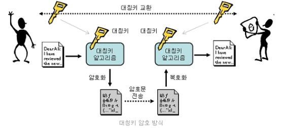
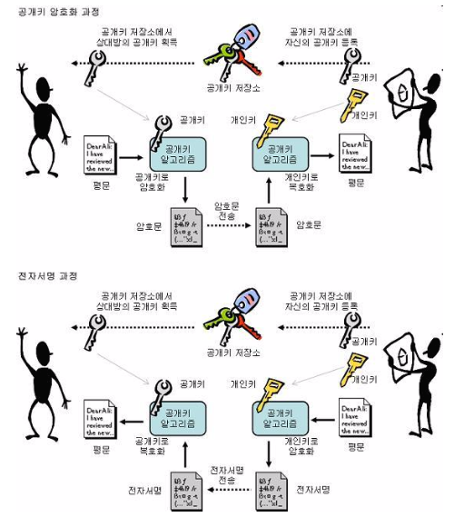
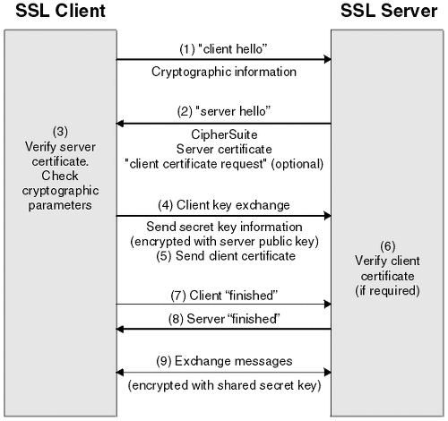

# TLS/SSL

# TLS/SSL

- TLS/SSL은 OSI 7계층에서 5계층에 해당
- 암호화 레이어를 통해 Application 단의 암호화를 수행
- 대칭키 암호화 기법과 비대칭 키 암호화 기법을 동시에 사용
- TLS/SSL이라고 불리는 이유
    - SSL은 1994년 넷스케이프사에서 개발한 프로토콜, 사실상 업계 표준화
    - 이후 SSL이 업그레이드되던 중 SSL3.0에서 취약점이 발견되어, SSL3.0을 기반으로 IETF에서 TLS 프로토콜을 개발
    - 이때 이후 업계 표준은 TLS이지만 SSL도 혼용되어 사용

# 암호화 방법

- 암호화 기법에는 대표적으로 대칭 키 암호화 기법과 비대칭 키 암호화 기법이 있다.
- 대칭 키 암호화 기법은 키가 1개이고, 비대칭 키 암호화 기법은 키가 2개이다.

## 대칭 키 암호화

- 같은 키를 이용하여 암호화와 복호화를 진행
- 암호화 키와 복호화 키가 동일함
- 키를 교환하는 과정에서 도청 시 도청자가 복호화 가능, 따라서 신뢰성 있는 키 교환 과정 필요

## 비대칭 키 암호화

- 암호화를 위한 키와 복호화를 위한 키가 다름
- 키는 하나의 키쌍 형태로 존재
- 외부에 공개하는 공개 키, 개인이 소유하는 비밀 키가 있음
- 공개 키로 암호화할 시 비밀 키로만 복호화할 수 있고, 비밀 키로 암호화할 시 공개 키로만 복호화할 수 있음

- 비대칭적인 특징 때문에 두 가지 방향으로 사용
    - 암호화
        - 공개된 공개 키 저장소에서 앨리스의 공개키를 수집
        - 밥이 앨리스의 공개 키로 암호화하여 전송
        - 앨리스는 본인의 개인 키를 이용해서만 복호화 가능, 다른 사람이 복호화가 불가능함을 보장 가능
    - 전자서명
        - 앨리스가 개인 키를 이용하여 암호화 진행(전자서명 생성)
        - 밥 공개된 공개 키 저장소에서 앨리스의 공개키를 수집
        - 생성된 전자서명을 밥에게 전달함
        - 밥은 앨리스의 공개키를 이용하여 전자서명 복호화, 이를 통해 앨리스가 보냈음을 보장할 수 있음

# TLS/SSL에서 암호화 과정

- 핸드셰이크 프로토콜을 통하여 대칭 키를 교환하는 과정을 거침

## Handshake 프로토콜

- 총 4단계 과정을 거침
    1. Hello
        - 클라이언트 → 서버
            - HELLO : 클라이언트가 서버에게 세션ID, 클라이언트가 지원하는 알고리즘 리스트, 버전, 클라이언트 생성 난수를 서버에 전달
        - 서버 → 클라이언트
            - HELLO : 서버가 클라이언트에게 세션ID, 선택한 알고리즘, 버전, 서버 생성 난수를 클라이언트에게 전달
        - HELLO 과정을 통해 공유하는 것
            - TLS/SSL 버전, 암호화 알고리즘, 키 생성을 위한 2개의 난수
    2. Server Certificate
        - 서버 → 클라이언트
            - ServerCertificate : 서버의 인증서가 포함된 정보를 전달(서버의 공개키 포함)
            - ClientRequest : 클라이언트의 인증서를 통한 인증 요구(Optional)
    3. Client Certificate
        - 클라이언트 → 서버
            - ClientCertificate : 클라이언트의 인증서가 포함된 정보를 보냄(클라이언트의 공개키 포함)
            - ClientKeyExchange : pre-master-secret을 생성하여 서버에게 전달, 이때 선택된 공개 키 알고리즘을 이용하여 서버와 공유(서버의 공개키로 암호화)
    4. Ready
        - 클라이언트 → 서버
            - finished : 키 교환을 위한 정보를 모두 전달했음을 확인
        - 서버 → 클라이언트
            - finished : 키 교환을 위한 정보를 모두 확인하고, 전달받았음을 확인
- 이후 교환한 pre-master-secret의 압축을 해제하여 master secret을 생성
- 생성된 master secret을 기반으로 세션 키 생성
- 이후 세션 키를 이용하여 대칭 키 암호화 통신 진행