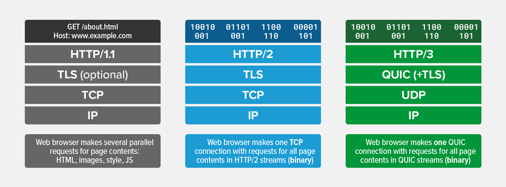
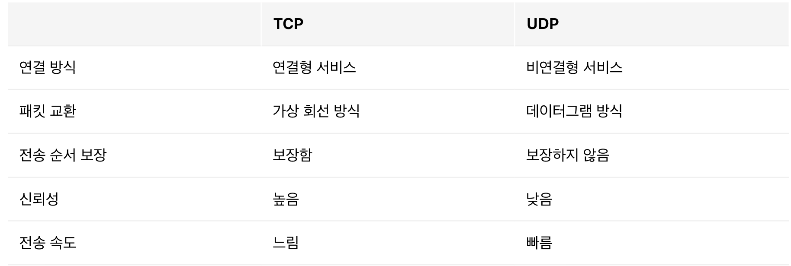

# HTTP/3

**HTTP/3** : QUIC(Quick UDP Internet Connections)프로토콜 위에서 돌아가는 HTTP

 
 

## TCP의 단점

신뢰성을 보장하기 위해 속도가 느립니다. 여기서 신뢰성은 송신자가 보낸 패킷을 순서에 맞게 그리고 유실없이 수신자가 받는 것을 의미합니다. 이렇게 신뢰성을 보장하기 위해서 TCP는 아래와 같이 여러한 장치들이 마련되어있습니다. 

- 3 Way Handshake
: 통신을 시작하고 종료할 때 미리 서버에 물어보고 연결을 하고 시작합니다

- HOLB(Head of line Blocking) : HTTP/2를 포함해 이전버전들도 가지고 있는 문제로 패킷이 순서를 지켜서 전달되야하다보니 중간에 문제가 생기면 전체 패킷이 늦어지게 됩니다.

 
 

속도를 높이기 위해서는 이런 것들을 건드려야하는데 TCP가 생길때부터 정의된 표준이기 때문에 제한사항이 많습니다. 즉 원하는대로 뜯어고치기가 쉽지 않았던 것입니다! 결국 그래서 선택한 것이 UDP입니다.

 
 
 
 

## UDP기반 QUIC프로토콜 채택 
- QUIC : TCP가 가지고 있는 여러 문제들을 해결하고 속도의 한계를 뛰어넘고자 구글이 개발한 UDP 기반의 프로토콜

- UDP : 데이터그램 방식을 사용하는 프로토콜이기 때문에 패킷간의 순서가 없이 독립적입니다. 목적지만 정해져있을 뿐 어떤 경로를 타서 목적지로 가는지는 중요하지 않기 때문에 연결설정을 하지 않습니다. 즉 3 Way Handshake과정이 필요가 없습니다.

그렇다면 UDP를 사용하면 속도는 챙기고 신뢰성은 버리는 것인가???  NO!!!

  
 
 

## UDP 커스터마이징 및 장점
UDP는 하얀 도화지 같은 프로토콜입니다. 즉 UDP는 데이터 전송 이외에 아무것도 정해지지않은 프로토콜입니다. UDP자체는 신뢰성을 보장하지 않지만 어떻게 커스터마이징 하냐에 따라 달라질 수 있습니다.

구글이 커스터마이징한 QUIC의 TCP대비 장점을 살펴보겠습니다

 
 

### 1. 연결 설정 시 레이턴시 감소

클라이언트가 보낸 요청을 서버가 처리하고 다시 클라이언트가 받는 것까지를 RTT(Round Trip Time)이라고 합니다. TCP + TLS 는 연결시에 1RTT + 2RTT로 총 3 RTT가 필요합니다. 반면에 QUIC는 첫번째 핸드쉐이크 때 연결에 필요한 정보와 데이터를 한번에 줘버립니다. 따라서 서버가 응답만 온다면 연결이 된 것으로 보고 총 1RTT만 필요로 합니다.

이게 가능한 이유는 세션키를 교환하기 전에 서버의 Connection ID를 사용하여 생성한 특별한 키인 `초기화 키(Initial Key)`를 사용하여 통신을 암호화하기 때문입니다. 

물론 이후의 TLS 1.3이 나오면서 TLS도 위와 비슷하게 동작합니다.

 
 

### 2. 패킷 손실 감지에 걸리는 시간 단축
TCP는 통신과정에서 생긴 에러를 ARQ 방식 즉, 재전송을 통해서 에러를 해결합니다. 그 중에서도 `Stop and Wait ARQ` 를 사용하며 이 방법은 패킷을 전송하고 일정시간이 지나도 적절한 답변이 오지 않으면 패킷을 다시보내는 방식입니다.

QUIC도 ARQ방식으로 패킷손실을 감지하고 TCP오 유사하게 동작하지만 몇가지 개선점이 있습니다. 

그중에서 대표적인 것은 타임아웃시간을 동적으로 계산할 때 정확한 RTT를 측정하기 위해 ACK가 어떤 응답에 대한 것인지 알기위해 타임스탬프를 찍어주는 것을 개선시킨 것입니다. QUIC는 이를 위한 공간을 헤더에 따로 만들고 패킷마다 고유한 번호를 부여해서 순서를 파악합니다. 이를 통해 패킷손실감지에 걸리는 시간을 단축합니다.

 
 

### 3. 클라이언트의 IP가 바뀌어도 연결이 유지됨
TCP의 경우 송신자와 수신자의 IP주소 포트를 통해서 연결을 식별하기 때문에 중간에 클라이언트 IP가 바뀌기라도 하면 연결이 끊기고 다시 핸드쉐이크과정을 거쳐야합니다.

반면에 QUIC는 Connection ID를 통해서 연결을 식별합닌다. Connection ID는 랜덤한 값일 뿐, 클라이언트의 IP와는 전혀 무관한 데이터이기 때문에 클라이언트의 IP가 변경되더라도 기존의 연결을 계속 유지할 수 있습니다. 이는 새로 연결을 생성할 때 거쳐야하는 핸드쉐이크 과정을 생략할 수 있게합니다.

 
 
 
 

## 앞으로..
QUIC의 장점만 살펴보았지만 사실 아직 부족한 점과 우려되는 점들이 많은 프로토콜입니다. 하지만 벌써 웹사이트 중에 25.2% 정도가 HTTP/3를 사용하고 있습니다. 앞으로 개선해나가며 발전된다면 곧 HTTP/2를 따라잡을 수 있지않을까합니다.

 
 
 
 

### 참고
- https://evan-moon.github.io/2019/10/08/what-is-http3/
- https://donggov.tistory.com/188

