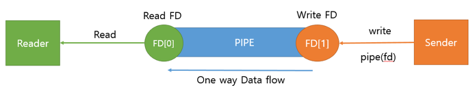

# 프로세스 vs 쓰레드

# 프로세스

- 실행 중인 프로그램으로, 메모리에 적재되어 CPU의 할당을 받을 수 있는 상태
- 컴퓨터에서 연속적으로 실행되고 있는 컴퓨터 프로그램
- 메모리에 올라와 실행되고 있는 프로그램의 인스턴스
- 운영체제로부터 시스템 자원을 할당받는 작업의 단위
    - 프로세스 제어 블록(PCB) 존재
- 전체적으로, 일종의 실행된 프로그램을 의미하고 있음

## 쓰레드와 비교되는 가장 큰 특징

- 각각 독립된 메모리 영역을 갖고 있음
    
    
    
    - Code, Data, Stack, Heap 구조
- 프로세스당 최소 1개의 스레드를 갖고 있다(메인스레드)
- 각 프로세스는 별도의 주소 공간에서 실행되며, 다른 프로세스의 변수나 자료구조에 직접 접근할 수 없고, 접근을 위해서는 프로세스 간 통신(IPC)를 활용해야 함

## IPC

### IPC 표준

- System V IPC
- POSIX IPC

### 다양한 IPC 설비

- PIPE
    - 익명의 pipe를 통해 동일한 ppid를 가진 프로세스 간 단방향 통신 지원
    - 부모-자식 프로세스 간 통신 시 사용
    - read-write 각각 block 모드로 작동
        
        
        
- Named PIPE
    - 이름이 정해진 pipe를 통해 프로세스 간 단방향 통신 지원
    - 연관 없는 프로세스 간 통신 시 사용
    - read-write 각각 block 모드로 작동
        
        
        
- Message Queue
    - 메모리를 사용한 pipe, 구조체 기반 통신
    - 프로세스간 다양한 통신에서 사용 가능
    - 커널에서 제공하는 Message Queue이므로 EnQueue하는데 제한이 잇을 수 있음
        
        
        
- Shared Memory
    - 시스템 상의 공유 메모리 주소를 활용
    - 일정한 크기의 메모리를 프로세스간에 공유
    - 커널에서 관리
    - 프로세스간 read-write를 모두 필요로 할때 사용
    - 프로세스 간 메모리 크기가 동일해야 함
        
        
        
- Memory Map
    - 파일을 프로세스의 메모리에 일정 부분 매핑시켜서 사용
    - 파일로 대용량 데이터를 공유할때 활용
        
        (내용추가 필요할 듯)
        
        
        
- Socket
    - 네트워크 소켓통신을 통한 데이터 공유
    - 원격으로 프로세스간 데이터 공유 시 사용
    - 데이터 세그먼트 처리 중요
        
        
        
- 시그널
    - 유닉스 시스템에서 사용되는 IPC
    - 특정한 신호를 바로 다른 프로세스로 보낼 수 있음

# 쓰레드

- 프로세스 내에서 실행되는 여러 흐름의 단위
- 프로세스의 특정 수행 경로
- 프로세스가 할당받은 자원을 이용하는 실행의 단위
- 전체적으로, 한 프로세스 내에서 실행 또는 흐름의 단위를 의미하고 있음

## 프로세스와 비교되는 특징

- 프로세스 내에서 Stack만 별도로 할당받고, Code, Data, Heap 영역은 공유
    
    
    
    - 한 프로세스 내에서 동작되기 때문에, 주소 공간 및 자원을 공유하되, 쓰레드마다 존재하는 지역 변수는 스택에 저장하면서 동작한다.
    - 각각의 쓰레드는 별도의 레지스터와 스택을 갖고 있음
    - 한 쓰레드가 프로세스 자원을 변경하면, 다른 이웃 쓰레드도 즉시 확인 가능

# 멀티프로세스 vs 멀티스레드

## 멀티프로세스

- 하나의 응용프로그램을 여러 개의 프로세스로 구성하여 각 프로세스가 하나의 태스크를 처리하도록 하는 것
- 장점
    - 여러 자식 프로세스 중 하나에 문제가 발생하더라도 자식 프로세스 하나만 죽기 때문에 영향의 확산이 없다
    - 멀티스레드에서 발생할 수 있는 공유 메모리 문제가 상대적으로 적다
- 단점
    - Context Switching에서의 오버헤드 발생
        - 캐시 메모리 초기화 등 무거운 작업이 진행되고, 많은 시간이 소모된다.
        - 각각 독립된 메모리 영역을 할당받기 때문에, Context Switching이 발생하면 캐시에 있는 모든 데이터를 리셋하고 다시 가져와야 함
    - 프로세스 간 복잡한 통신 기법
        - 각각 독립된 메모리 영역을 할당받기 때문에 프로세스 사이의 변수를 공유할 수 없고, IPC를 활용해야 한다.

## 멀티스레드

- 하나의 응용프로그램을 여러개의 스레드로 구성하고 각 스레드가 하나의 작업을 처리하도록 하는 것
- 대부분 멀티 스레딩을 기본으로 하고 있음
- 웹이 대표적인 멀티스레드 응용 프로그램
- 장점
    - 시스템 자원 소모 감소
        - 프로세스를 생성하여 자원을 할당하는 시스템 콜 감소, 자원 관리 효율성 증가
    - 시스템 처리량 증가(처리비용 감소)
        - 스레드간 데이터를 주고받는것이 쉬움
        - 스레드 간 작업량이 작아  Context Switching 시간이  짧음
    - 간단한 통신 방법으로 인한 프로그램 응답 시간 단축
        - 스택 영역을 제외한 메모리 공유, 통신의 부담이 적음
- 단점
    - 설계에 유의해야 함
    - 디버깅이 까다로움(여러 스레드가 동시에 돌아가기 때문)
    - 단일 프로세스 시스템은 효과를 기대하기 어려움
    - 다른 프로세스에서 스레드 제어 불가능(프로세스 밖에서 스레드 제어 불가)
    - 자원 공유 문제 발생(동기화 문제, critical section)
    - 하나의 스레드에 문제가 발생하면 전체 프로세스 영향