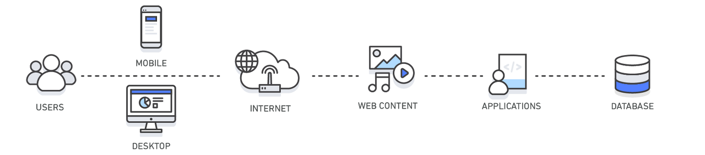
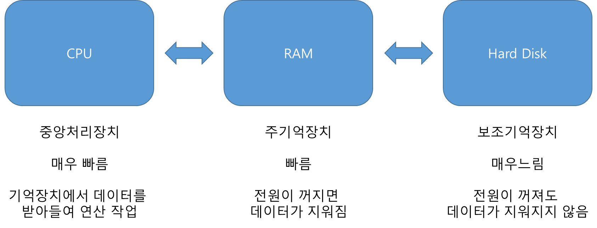
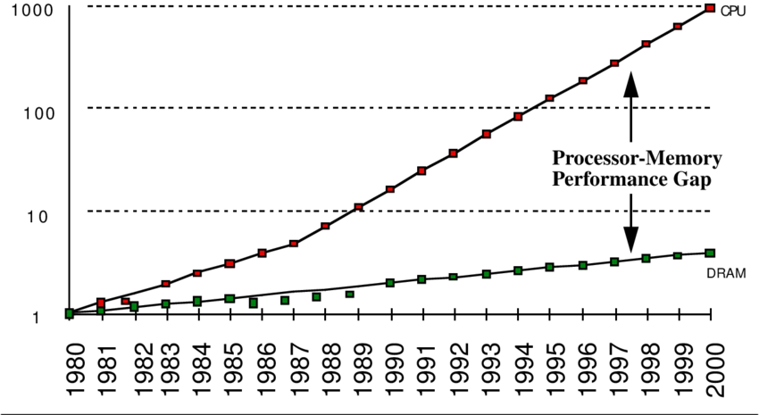
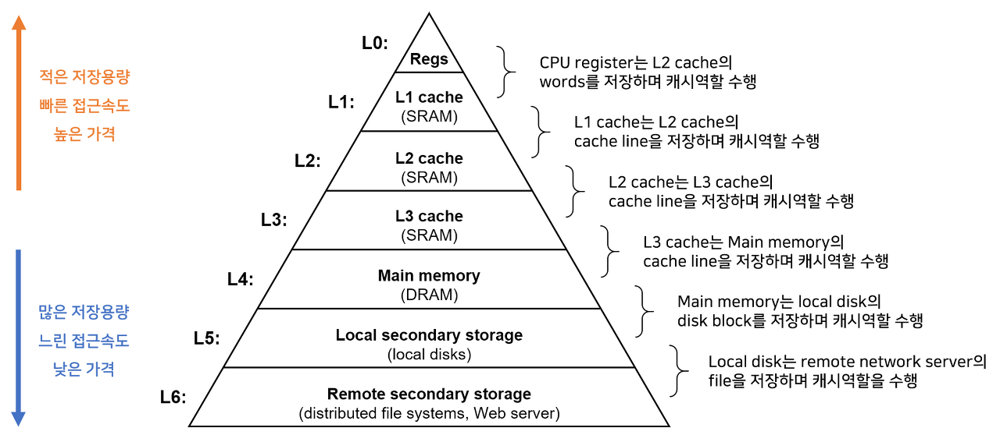
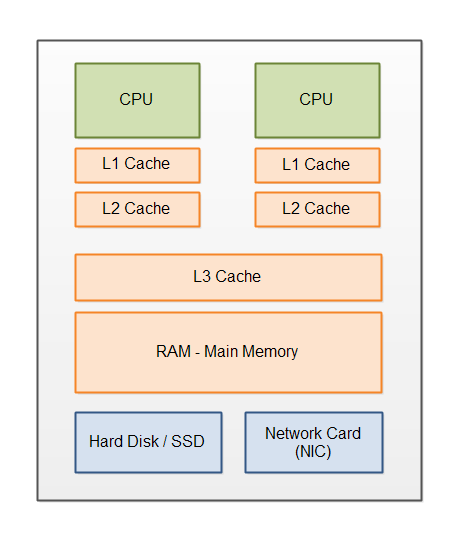
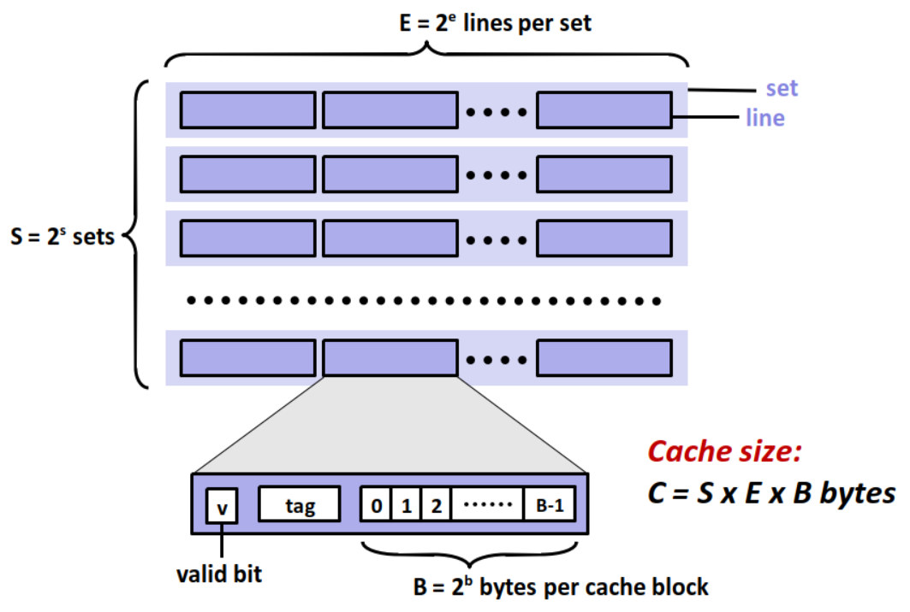
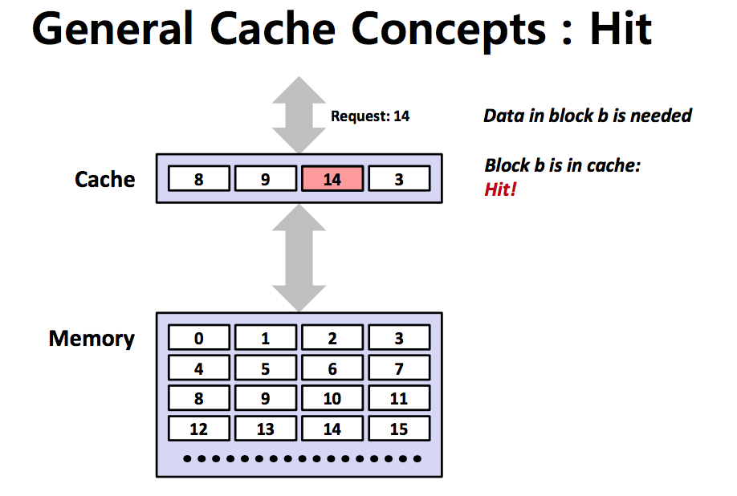
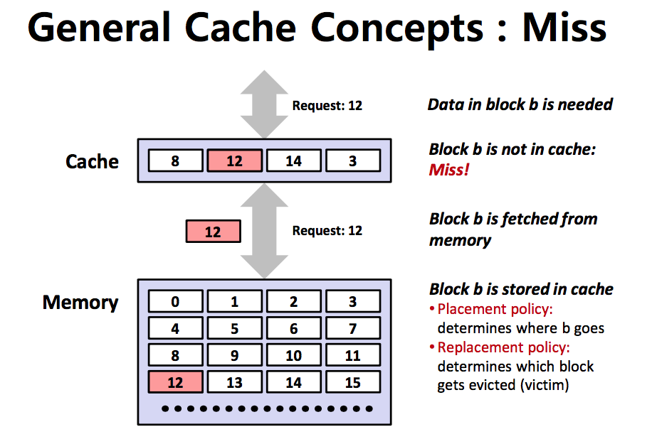

# 캐시


오늘날 캐싱은 하드웨어 수준에서 그치는 게 아니라 운영체제, CDN, DNS 등의 네트워킹 계층, 그리고 웹 애플리케이션 및 데이터베이스를 비롯한 다양한 기술 계층에 걸쳐 적용되고 활용되고 있습니다.

### 캐시란 무엇일까요?

캐시란 자주 필요한 데이터가 값의 복사본을 일시적으로 저장, 보관하기 위해 사용하는 곳입니다.

이러한 캐시를 사용하는것을 캐싱이라고 부릅니다.

캐시를 왜 사용하는 것 일까요? 

## 캐시 메모리의 도입
컴퓨터의 동작 흐름을 통해 캐시 메모리의 도입에 대해 알아보겠습니다.


컴퓨터의 동작 흐름을 간단히 보자면, 하드 디스크에 있는 데이터를 RAM에서 불러오고 CPU는 RAM에 저장되어있는 데이터를 이용하여 연산작업을 수행합니다.



위 그래프는 연도별 CPU와 RAM 간의 성능 차이 그래프입니다. CPU는 해를 거듭할수록 성능이 급격하게 좋아지는 반면, RAM은 그렇지 않다는걸 알 수 있습니다. 

이렇게 격차가 벌어지는 이유는 CPU와 다르게 메모리는 **속도보다 메모리 자체 용량을 늘리는게 주 목표이기 때문입니다.**

CPU는 데이터를 처리하기 위해 메모리와 끊임없이 데이터를 주고받아야 하는 구조입니다.

결과적으로 위와 같이 CPU와 메모리 간 성능 차이가 점점 더 벌어지고 이렇게 된다면 **메모리가 CPU의 데이터 처리 속도를 쫓아가지 못해 CPU가 메모리를 기다려야 하는 병목현상이 발생**합니다.

따라서 이 병목현상을 완화하기 위해 CPU와 메인 메모리 사이에 **크기는 작지만 속도가 빠른 캐시 메모리를 두고**, 

캐시 메모리에 향후 재사용할 가능성이 클 것으로 예상되는 데이터의 복사본을 저장해둔 후 CPU가 요청하는 데이터를 바로 전달할 수 있도록 합니다. 

즉, CPU와 메모리간 데이터 처리 속도, 병목 현상을 해결하기 위해 캐시 메모리가 도입되었습니다.

캐싱은 CPU와 RAM 사이에서만 사용되는 것은 아닙니다. 메모리 계층 구조를 통해 더 알아보겠습니다.

## 메모리 계층 구조

L1~ L3 캐시를 사용하는 메모리 계층 구조
캐시 메모리를 포함한 컴퓨터의 메모리 계층 구조는 위와 같습니다.

계층의 위에 있을수록 속도가 빠르고 비싸며 CPU와 가깝습니다.

여기서의 특징은 메모리 계층 구조에서 **한 계층은 바로 아래 계층에 대하여 캐싱 작업을 수행**합니다. 

L1은 L2의 캐시 역할, L2는 L3의 캐시 역할, L3는 메인 메모리와 디스크의 캐시 역할을 수행하는 식입니다.

여러 개의 캐시를 활용한 계층구조를 사용하여 임시 정보를 저장해 성능을 개선시킬 수 있기 때문에 캐시를 사용합니다.

이와 같은 **메모리 계층 구조의 목적**은 캐싱을 이용하여 빠르고 작은 메모리와 크고 느린 메모리의 장점을 조합해서 **크고 빠른 메모리**처럼 행동하도록 만드는 것입니다.

## L1, L2, L3 Cache


위 메모리 계층 구조에서 나온 L1, L2, L3 캐시에 대해 알아보겠습니다. 여기서의 L은 `Level`을 뜻합니다.

**L1 캐시**는 일반적으로 CPU 칩 안에 내장되어 데이터 사용/참조에 가장 먼저 사용됩니다. L1 캐시는 보통 8~64KB 정도의 용량으로 CPU가 가장 빠르게 접근하게 되며, 여기서 데이터를 찾지 못하면, 이제 L2 캐시 메모리로 넘어갑니다.

L1 캐시는 CPU 내부에 존재하므로 L1 캐시에서 데이터를 참조할 경우 속도 저하는 발생하지 않습니다.

L1 캐시는 속도를 위해 I 캐시와 D 캐시로 나눕니다.

* Instruction Cache (I캐시): 메모리의 code 영역 데이터를 다루는 캐시.
* Data Cache (D캐시): code 영역을 제외한 모든 데이터를 다루는 캐시.


하지만 메인 메모리의 모든 데이터를 L1 캐시에 저장할 수 없기에 L1 캐시에 없는 데이터를 CPU가 요구할 경우 속도의 저하로 이어질 수 있습니다. 그렇기 때문에 L2 캐시를 하나 더 둬서 이용하게 됩니다.


**L2 캐시**는 L1보다 훨씬 크지만 동시에 느립니다. 일반적으로 64KB~4MB 정도가 사용되며 L2 캐시는 CPU 회로판에 별도의 칩으로 내장됩니다. 앞서 말한 대로 L1 캐시에서 데이터를 먼저 찾고, 이를 찾지 못하면 L2 캐시로 넘어가 데이터를 찾습니다. L2 캐시는 L1 캐시보다 느리지만, 일반 메모리(RAM)보다는 빠릅니다.

**L3 캐시**도 동일한 원리로 작동됩니다. 보통 L2 캐시로 충분하기 때문에 웬만한 프로세서에서는 L3를 달고 있지 않다고 합니다. 하지만 멀티 코어 시스템에서 사용하게 되면 더 높은 수준의 캐시로 승격된다고 합니다.

## 캐시 라인
캐시(cache)는 CPU와 가까이에 위치하면서 빈번하게 사용되는 데이터를 놔두는 장소입니다.

하지만 캐시가 아무리 가까이 있더라도 찾고자 하는 데이터가 어느 곳에 저장되어 있는지 몰라 모든 데이터를 순회해야 한다면 시간이 오래 걸리게 됩니다.

즉, 캐시에 목적 데이터가 저장되어 있다면 바로 접근하여 출력할 수 있어야 캐시가 의미 있어집니다.

그렇기 때문에 **캐시에 데이터를 저장할 때 접근에 대한 정보를 태그들로 나타낸 자료구조**에 저장하게 되는데 이를 **캐시 라인**이라고 합니다.

이 캐시 라인은 밑에 설명할 캐시 메모리 구조에서 나타납니다.

## 캐시 메모리의 구조



캐시 메모리는 S개의 집합(Set)으로 이뤄져 있고, 각 집합은 E개의 캐시 라인(Cache Line)을 저장합니다.

각 캐시 라인은 메인 메모리에서 가져오는 **블록(Block)** 하나와 그것이 유효한지를 나타내는 **유효 비트(Valid Bit)**, 그리고 동일한 집합에 들어올 수 있는 다른 블록들과 구별하기 위한 **태그(Tag)**를 저장합니다.


다시 말하자면, 각각의 **캐시 블록(Cache Block)**은 데이터를 담고 있으며

**태그(Tag)**는 캐시 블록의 고유 식별 값으로 CPU 프로세서는 캐시 태그 값을 통해 캐시 블록에 접근할 수 있습니다. 


또한, **유효 비트**를 통해 해당 캐시 블록에 올바른 데이터가 저장되어 있는지 나타내 줍니다.

만약 캐시 블록이 비어있거나 올바르지 못한 값을 가지고 있다면 유효 비트는 0으로 설정되어 유효한 블록이 없다는 걸 알려줍니다.

## 캐시의 지역성
다시 돌아와서, **재사용할 가능성이 클 것으로 예상되는 데이터의 복사본을 저장**함으로써 **캐싱**을 할 수 있다고 했습니다.

그렇다면 재사용할 가능성이 큰지 어떻게 알 수 있을까요?

이는 캐시의 지역성을 통해 이를 알 수 있습니다.

**지역성**이란 데이터 접근이 시간적 혹은 공간적으로 가깝게 일어나는 것을 의미합니다.

지역성의 전제조건은 모든 데이터를 균등하게 참조하는 것이 아니라 **일부 특정 데이터에 대해서 더 많이 참조하는 경향**이 있다는 것입니다.

캐시에서 지역성에는 시간 지역성과 공간 지역성이 있습니다.

### 시간적 지역성
* 시간적 지역성이란, 특정 데이터가 한 번 접근되었을 경우, 가까운 미래에 또 한번 데이터에 접근할 가능성이 높은 것을 의미합니다.
* 최근에 참조된 주소의 내용은 곧 다음에 다시 참조되는 특성입니다.
* 메모리 상 같은 주소에 여러 차례 읽기 쓰기를 수행할 경우 상대적으로 작은 크기의 캐시를 사용해도 효율성을 높일 수 있습니다.

예를 들어 반복문에서의 조건 변수 i를 예로 들 수 있습니다.

### 공간적 지역성
* 공간적 지역성이란, 특정 데이터와 가까운 주소가 순서대로 접근되는 경우를 의미합니다.
* 한 메모리 주소에 접근할 때 그 주소뿐 아니라 해당 블록을 전부 캐시에 가져옵니다.
* 이때 메모리 주소를 오름차순이나 내림차순으로 접근한다면, 캐시에 이미 저장된 같은 블록의 데이터를 접근하게 되므로 캐시의 효율성이 크게 향상될 수 있습니다.


예를 들어 순서대로 접근할 가능성이 큰 배열이 있습니다. 

**시간 지역성, 공간 지역성을 충족하는 예제**
```java
for(int i=0; i<3; i++) {
	data[i+1] = data[i] + 1;
}
```
위는 시간, 공간적 지역성을 충족하는 간단한 코드 예제입니다.

위의 배열에서 변수 i를 선언 후 재 접근하므로 **시간 지역성(가까운 미래에 또 한 번 데이터 접근)**이라고 볼 수 있습니다.

data 배열에 인덱스 0부터 1,2 순차적으로 접근하므로 **공간 지역성(가까운 주소가 순서대로 접근)**이라고 볼 수 있습니다.

## 캐시 히트와 캐시 미스
지역성의 원리를 이용해 캐시에 데이터들을 넣었습니다. 그러면 이제 CPU가 메모리에 데이터를 요청할 때, 메인 메모리에 접근하기 앞서 캐시 메모리에 접근하여 데이터 존재 여부를 확인하겠죠

이때 캐시 메모리가 해당 데이터를 가지고 있다면 **캐시 히트**라고 하며




해당 데이터가 없어서 메인 메모리에서 가져와야 한다면 **캐시 미스**라고 합니다.




위에 소개했던 L1~L3 캐시에서 연산에 필요한 데이터가 L1 캐시에 있다면 캐시 히트,

만약 L1 캐시에 없다면 캐시 미스 후 L2 캐시를 검사하여 L2 캐시에 있다면 캐시 히트,

만약 L2 캐시에도 없다면 캐시 미스 후 L3 캐시를 검사하여 L3 캐시에 있다면 캐시 히트,

만약 L3 캐시에도 없다면 캐시 미스 후 메인 메모리에서 데이터를 가져옵니다.


---
예상되는 질문

* 캐시란 무엇인가요?
* 캐시를 사용하는 이유가 무엇인가요?
* 캐시의 지역성에 대해 설명해보세요