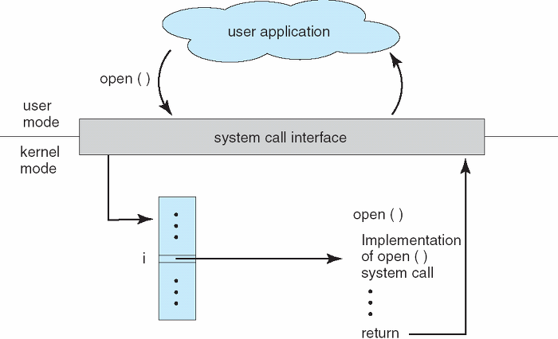
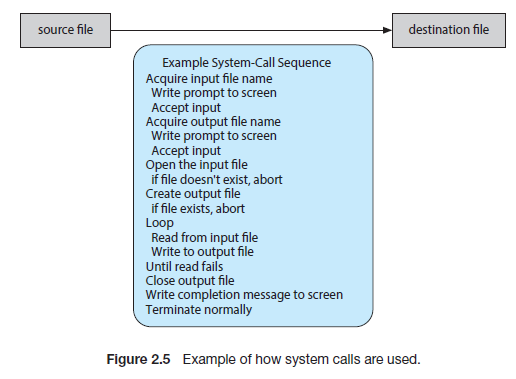

# 시스템 콜

# 시스템 콜

- `커널 모드`에서 사용 가능한 서비스에 대한 인터페이스를 제공
- 일반적으로 C/C++언어로 작성된 함수 형태로 제공
- 간단한 프로그램이라도 운영체제의 기능을 아주 많이 사용하게 됨 → API에 따라 프로그램을 설계함으로써 매개변수, 반환값을 이용하여 함수의 사용이 가능



- API를 사용하는 이유
    - 프로그램의 호환성 - 같은 API를 지원하면 어느 시스템이건 컴파일/실행 가능
    - 실제 시스템 콜은 더 자세한 명세가 필요하므로 API가 더 쉬움
    - 대부분의 API는 사실상 시스템 콜과 유사함
- 런타임 환경
    - 특정 응용 프로그램을 실행하는 데 필요한 전체 소프트웨어 및 연계 소프트웨어를 모두 통틀어 지칭
    - 시스템 콜 인터페이스 제공
- 시스템 콜 예제
    
    ```bash
    cp input.txt output.txt
    ```
    
    - 위와 같은 명령이 있다고 생각해 보자.
    - 문장 입력에 I/O 시스템 콜 사용
    - cp라는 프로그램을 이용하는데, 해당 프로그램 내부적으로 시스템 콜을 활용하여 구현되어 있음
        - input.txt 파일이 접근 가능한 파일인지 확인하는 시스템 콜
        - output.txt라는 파일이 쓰기 가능한 파일인지 확인하는 시스템 콜
        - 파일을 저장하는 시스템 콜



- 운영체제에게 매개변수를 전달하는 방법(시스템 콜 매개변수)
    - 레지스터를 통해 전달
    - 레지스터보다 많은 경우 메모리 내 블록/테이블에 저장하고 블록 주소를 통해 전달
    - 리눅스에서는 5개 이하일 때 레지스터를 쓰고, 5개가 넘으면 스택에 넣어서 전달
- 유형
    - 프로세스 제어
        - 실행, 제어 전환, 종료 등 수행 상태 제어
        - 공유 데이터를 위한 Lock 시스템 콜
    - 파일 조작
        - 파일 생성/삭제, 열기/닫기, 읽기/쓰기, 커서 위치 변경, 되감기
        - 파일 속성 획득, 속성 설정
        - 파일 이동/복사
    - 장치 관리
        - 장치 요청 - 독점적 사용 보장
        - 장치 릴리즈 - 사용 종료
        - 파일 형태로 장치 관리, 열기/닫기, 읽기/쓰기, 위치 변경 등 활용
        - 파일과 유사한 구조가 많아서 파일-장치 구조로 결합
    - 정보 유지
        - 현재 시간, 날짜 리턴
        - 메모리 덤프
        - 한 명령어 실행(single step) 모드를 활용하면 모든 명령 이후 트랩을 실행시켜 디버깅 가능
        - strace는 실행될 때마다 각 시스템 콜 나열해서 디버깅 해줌
        - time profile을 위한 정규 타이머 인터럽트(일정 시간마다 프로그램 카운터 값 기록)
        - 모든 프로세스 정보에 접근, 특정 프로세스 정보를 획득하고 설정
    - 통신
        - 호스트 이름, 프로세스 이름 가져오기
        - Open, Close
        - Accept, Wait for connection
        - 서버에서의 read_msg, write_msg
        - 공유 메모리 모델에서 공유 메모리 접근을 위한 create, attach
    - 보호
        - 권한 설정, 권한 가져오기
        - 허가된 유저, 불허된 유저 확인

# 대표적인 예제

- fork() → 빈출
    - 현재 프로세스와 동일한 새로운 프로세스를 생성할 때 사용
    - child process를 생성하기 위한 시스템 콜
    - 특징
        - 부모 프로세스 : 리턴 값이 자식 프로세스의 PID
        - 자식 프로세스 : 리턴 값이 0
        - 자식 프로세스는 열린 파일과 같은 자원, 권한, 스케줄링 속성을 부모 프로세스로부터 상속
    - 쓰기 시 복사(copy-on-write) 사용
        - 자식 프로세스가 시작할 때 부모의 페이지를 당분간 함께 사용
        - 둘중 한 프로세스가 공유중인 페이지에 쓸 때(변경점이 생겼을 때) 복사본을 생성
        - 수정을 하는 페이지에 대해서만 복사본이 생김 → 코드와 같은 곳은 자식과 부모 간 그대로 공유
        - 별도의 수정이 없을 시 vfork를 사용할 수도 있음(쓰기 시 복사 미사용, 데이터 영역 공유)
    - 데몬 프로세스의 경우 PID가 1인 systemd에서 fork되어 생성됨, 모든 데몬 프로세스의 루트 프로세스는 systemd
- exec()
    - 특정 바이너리 파일을 메모리로 적재하고, 기존 프로그램을 파괴하는 명령
    - 기존 프로세스에 새로운 프로세스를 덮어쓰기 하는 작업
    - 특징
        - 포크 이후 사용하면 부모 프로세스와 커널 자원을 공유하는 통신 가능한 다른 프로세스가 생성되는 것으로 볼 수 있음
        - 메모리가 새로운 프로세스로 대체되는 과정