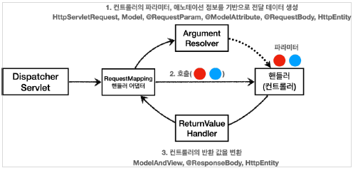
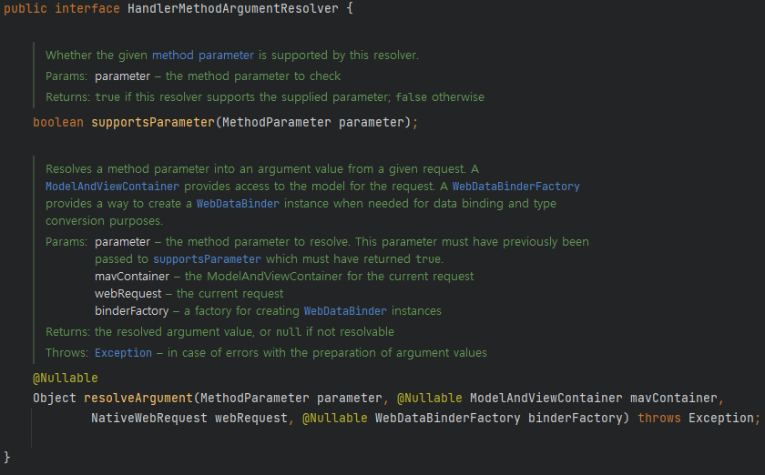
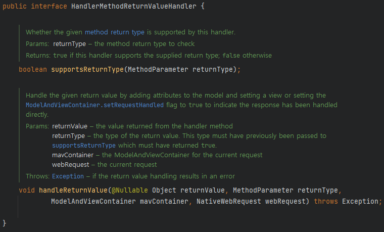
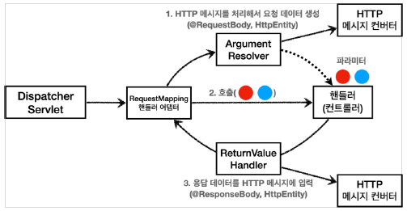
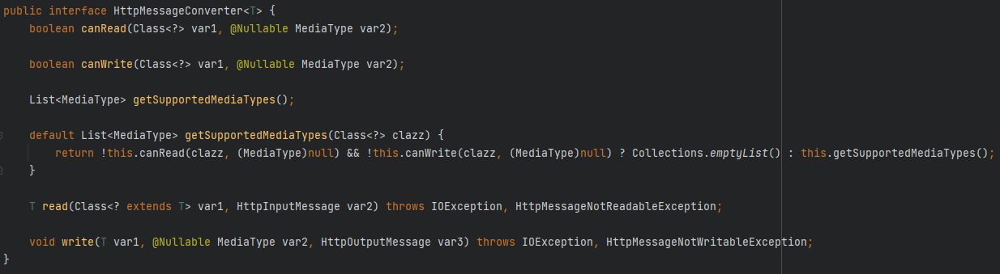

# HTTP 메시지 컨버터

Spring에서는 HTTP 메시지 컨버터를 이용해 XML, JSON과 같은 형식의 RequestBody 혹은 ResponseBody를 다룰수 있게 됩니다.

대표적으로 HTTP 메시지 컨버터는 `@RequestBody`, `@ResponseBody` 등을 사용할때 동작하게 됩니다.

- `@RequestBody` 사용 예시

```java
@PostMapping("/hello")
public ResponseEntity<HttpStatus> create(@RequestBody HelloDto helloDto) {
	helloService.doSomething(helloDto);
	return new ResponseEntity<>(HttpStatus.OK);
}
```

- `@ResponseBody` 사용 예시

```java
@ResponseBody
@GetMapping("/hello/{id}")
public HelloDto getOne(@PathVariable long id) {
	return helloService.get(id);
}
```

위와 같이 사용하게 될 경우, Spring은 **메시지 컨버터를 사용해**  HTTP 요청이나 응답을 메시지로 변환시켜줍니다.

우선 HTTP 메시지 컨버터를 알아보기 전에, `Argument Resolver`와 `ReturnValueHandler`에 대한 이해가 필요합니다.

→ `Argument Resolver`와 `ReturnValueHandler`가 **HTTP 메시지 컨버터를 사용**하기 때문

## Argument Resolver와 ReturnValueHandler

### 1. Argument Resolver



`Argument Resolver`는 컨트롤러의 파라미터, 애노테이션 정보를 기반으로 컨트롤러(핸들러)가 필요로 하는 다양한 파라미터의 값(객체)를 생성해줍니다.

정확한 명칭은 `Argument Resolver`가 아니라 `HandlerMethodArgumentResolver` 입니다.

- `HandlerMethodArgumentResolver` 내부 구현 코드



`supportsParameter()` 를 호출해 해당 파라미터를 지원하는지 확인 후 

만약 지원하는 파라미터라면 `resolveArgument()` 를 호출해서 객체를 생성해줍니다. 

이렇게 생성된 객체는 컨트롤러의 파라미터로 전달되어집니다.

 

### 2. ReturnValueHandler

`ReturnValueHandler`도 `ArgumentResolver`와 비슷합니다만 다른점은 컨트롤러의 반환값을 변환해준다는 점입니다.

정확한 명칭은 `HandlerMethodReturnValueHandler` 로 줄여서 `ReturnValueHandler`라고 부릅니다.

- `HandlerMethodReturnValueHandler` 내부 구현 코드



이 부분도 Argument Resolver와 마찬가지로 `supportsReturnType()` 을 이용해 

해당 리턴타입을 지원하는지 확인 후 `handleReturnValue()` 를 호출해 리턴값에 대한 처리를 해줍니다.

  

위에 소개한 **Argument Resolver**와 **ReturnValueHandler 전부** **HTTP 메시지 컨버터를 이용**합니다.

그렇다면 다시 메시지 컨버터가 어떻게 동작되는지 알아보겠습니다.

## HTTP 메시지 컨버터

### 1. 동작원리



요청과 응답의 경우에서의 HTTP 메시지 컨버터에 대해 알아보겠습니다.

HTTP 메시지 컨버터는 HTTP 요청과 HTTP 응답 둘다에서 사용됩니다.

- 요청
    - Argument Resolver가 HTTP 메세지 컨버터를 호출해 필요한 객체를 생성합니다.
    - `@RequestBody` , `HttpEntity(RequestEntity)` 에 적용
        - `HttpEntity`는 `ResponseEntity` 의 상위 클래스다. header와 body를 담을 수 있음
- 응답
    - ReturnValueHandler가 HTTP 메시지 컨버터를 호출해 응답 결과를 생성합니다.
    - `@ResponseBody` , `HttpEntity(ResponseEntity)` 에 적용
    
- `HTTPMessageConverter` 내부 구현 코드



`canRead()` , `canWrite()` : 메시지 컨버터가 해당 클래스와 미디어 타입을 지원하는지 확인

`read()` , `write()` : 메시지 컨버터를 통해 메시지를 읽고 쓰는 기능 

### 2. HTTP 메시지 컨버터의 대표적인 구현체들

```java
0 = ByteArrayHttpMessageConverter
1 = StringHttpMessageConverter
2 = MappingJackson2HttpMessageConverter
...
```

스프링 부트는 다양한 메시지 컨버터를 제공하는데, 대상 클래스 타입과 미디어 타입 둘을 체크해서
사용여부를 결정합니다. 

만약 만족하지 않으면 다음 메시지 컨버터로 우선순위가 넘어갑니다.

요청에서는 **파라미터의 클래스 타입**과 **HTTP 요청 메시지 헤더에서의** **Content-Type**을 통해 메시지 컨버터가 결정되고

응답에서는 **리턴에 대한 클래스 타입**과 **HTTP 요청 메시지 헤더에서의** **Accept**를 통해 메시지 컨버터가 결정됩니다.

- `ByteArrayHttpMessageConverter` : byte[] 데이터를 처리
    - 클래스 타입: byte[] , 미디어타입: **/**
    - 요청 예) @RequestBody byte[] data
        
        ```java
        content-type: application/json
        
        @RequestMapping
        public void hello(@RequetsBody byte[] data) {}
        ```
        
    - 응답 예) @ResponseBody return byte[] , accept: application/octet-stream
        
        ```java
        accept:application/octet-stream
        
        @ResponseBody
        @RequestMapping
        public byte[] hello() {
        	byte[] result = helloSerivce.doSomething();
        	return result ;
        }
        ```
        
- `StringHttpMessageConverter` : String 문자로 데이터를 처리
    - 클래스 타입: String , 미디어타입: **/**
    - 요청 예) @RequestBody String data
        
        ```java
        content-type: application/json
        
        @RequestMapping
        public void hello(@RequetsBody String data) {}
        ```
        
    - 응답 예) @ResponseBody return "ok", accept: text/plain
        
        ```java
        accept:text/plain
        
        @ResponseBody
        @RequestMapping
        public String hello() {
        	return "ok";
        }
        ```
        
- `MappingJackson2HttpMessageConverter` : json 데이터를 처리
    - 클래스 타입: 객체 또는 HashMap , 미디어타입: application/json 관련
    - 요청 예) @RequestBody HelloData data
        
        ```java
        content-type: application/json
        
        @RequestMapping
        void hello(@RequetsBody HelloData data) {}
        ```
        
    - 응답 예) @ResponseBody return helloData, accept: application/json 관련
        
        ```java
        accept:application/json
        
        @ResponseBody
        @RequestMapping
        public HelloDto hello() {
        	helloDto helloData = helloSerive.doSomething();
        	return helloData;
        }
        ```
        

## 정리

- HTTP 요청 데이터 읽기
    - HTTP 요청이 오고, 컨트롤러에서 @RequestBody , HttpEntity 파라미터를 사용
    - 메시지 컨버터가 메시지를 읽을 수 있는지 확인하기 위해 `canRead()` 를 호출
    - 대상 클래스 타입을 지원하는가.
    예) @RequestBody 의 대상 클래스 ( byte[] , String , HelloData )
    - HTTP 요청의 Content-Type 미디어 타입을 지원하는가.
    예) text/plain , application/json ,  */*
    - `canRead()` 조건을 만족하면 `read()` 를 호출해서 객체 생성하고, 반환
- HTTP 응답 데이터 생성
    - 컨트롤러에서 @ResponseBody , HttpEntity 로 값이 반환
    - 메시지 컨버터가 메시지를 쓸 수 있는지 확인하기 위해 `canWrite()` 를 호출
    - 대상 클래스 타입을 지원하는가.
    예) return의 대상 클래스 ( byte[] , String , HelloData )
    - HTTP 요청의 Accept 미디어 타입을 지원하는가.(더 정확히는 @RequestMapping 의 produces )
    예) text/plain , application/json , */*
    - `canWrite()` 조건을 만족하면 `write()` 를 호출해서 HTTP 응답 메시지 바디에 데이터를 생성